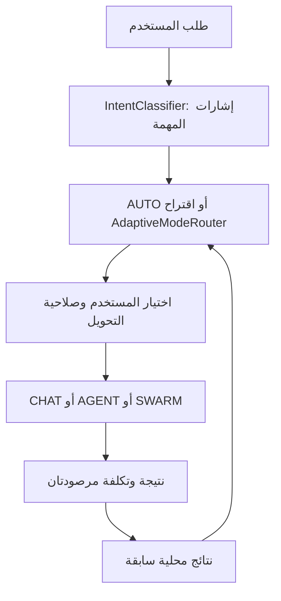

# محرك القرار والتعلم المحلي في OmniDev

> وصف محرك القرار والتعلم من نتائج التشغيل. التوصية والتحكم في السماح مساران منفصلان؛ قياس الدقة والكلفة يحتاج مهامًا ممثلة ونتائج متحققة.

## سلسلة القرار

| المكوّن | ما يفعله | ما لا يملكه |
|---|---|---|
| `IntentClassifier.kt` | إشارات التنفيذ والتعديل والتحقق والتوازي واتساع الطلب ونطاقه | ضمان فهم المقصود دائمًا |
| `AdaptiveModeRouter.kt` | اقتراح Chat→Agent/Team، Agent→Team عند التعثر المناسب، Team→Agent عند غياب فائدة التوازي | منح إذن تحويل الوضع |
| `ModeSwitchPermissionStore.kt` | الإذن وحدود التحويل المعتمد على تفضيل المستخدم | استنتاج الجودة من التجارب |
| `ModeOutcomeLearner.kt` | تخزين نتائج مجمعة بحسب شكل المهمة والوضع، تكلفة التوكن والزمن إن وصلت | حفظ النص الخام في سجل القرار أو إرسال أوزان للخادم |
| `ModeDecisionModel.kt` | توقع نجاح محلي تدريجي بإشارات عددية محدودة لكل وضع | نموذج لغوي أو embeddings أو ضمان استدلال موثوق من عينات قليلة |
| `AgentDecisionPolicy.kt` | ضبط أولوية الخطوات وحجم نتائج الأدوات | تغيير سياسات أذونات Android |

## اختيار الوضع والتحويل

`OmniMode.kt` يعرّف `AUTO`, `CHAT`, `AGENT`, `SWARM`. في Chat، طلب تنفيذ صريح ينتج اقتراحًا لوضع عامل؛ وجود أعمال مستقلة والتوازي الحقيقي قد يرفع Team. عند تعثر Agent لا يكون التصعيد مفيدًا إن كان الخطأ بنية تحتية عامة أو ينتظر فعل المستخدم أو كانت المهمة غير قابلة للتقسيم. عند تخطيط Team، مهمة واحدة أو مهمتان متسلسلتان بلا تنفيذ متوازٍ كافٍ تجعل Agent مرشحًا أبسط. الاقتراح يتضمن درجة ثقة وأسبابًا قصيرة؛ تطبيقه يخضع لمسار الإذن المستقل. مخرجات الأداة أو الصفحة ليست تفويضًا لتغيير الوضع.

`TeamExecutionPolicy` يصنّف سلامة التنفيذ المتوازي، و`TeamBudgetAllocator` يضبط توزيع الميزانية، و`SwarmOrchestrator` يتعامل مع المخطط والعمال وتجميع النتيجة. الأجزاء المتسلسلة لا تكتسب سرعة تلقائيًا بزيادة عدد الوكلاء.

## النموذج الصغير

`ModeDecisionModel` انحدار لوجستي محلي بـ **12 بُعدًا**: ثابت، قصد التنفيذ، التعديل، التحقق، التوازي، الاتساع، التعقيد البنيوي، الكود، الجهاز، البحث، عدد المجالات وطول الطلب بعد تقييد القيم. الأوزان لكل وضع وتُحدّث بخطوة صغيرة وانتظام وحدود للقيم؛ نجاح محقق يزن أكثر من ادعاء نجاح غير محقق، والفشل قد يكون سببه بيئة التشغيل. التخزين في `SharedPreferences`، وليس تدريب نموذج عام أو نقل النصوص إلى خدمة تدريب.

`ModeOutcomeLearner` يحتفظ بإحصاءات نجاح/فشل/توقف مع prior، ومتوسط تكرارات وزمن وتوكنز عندما تتوافر، وبحد أقصى لمجموعات المهام وسجل قرارات دائري. تأثيره الاستشاري على ثقة التوجيه لا يتعدى ±0.12. المقارنة بين Agent وTeam عند قرار الكلفة تحتاج نتائج لهما في مجموعة المهمة نفسها؛ ترشيح النموذج يحتاج **12 ملاحظة على الأقل لكل منهما**، مع فارق توقع، ونجاح غير أدنى بصورة مؤثرة، وتكلفة مناسبة. مسار المقارنة غير المعتمد على توقع النموذج يتطلب **6 ملاحظات على الأقل لكل منهما** وتكاليف توكن فعلية. إذا غابت البيانات يرجع القرار إلى خط الأساس.

**القيود:** مجموعة الإشارات مجمّعة وقد تخلط مهام مختلفة؛ نجاح غير متحقق ليس شهادة جودة؛ أرقام التوكنز لا تتوفر دائمًا؛ `SharedPreferences` محلي للجهاز وقد يعاد ضبطه. ضع مقاييس قبول قبل تغيير العتبات: نجاح متحقق، زمن، توكنز، عدد الاستدعاءات، ومعدل اقتراح غير مرغوب، لكل فئة مهمة، مع مقارنة في المهام العربية والإنجليزية.

## استرجاع الكود وتقليل السياق

- `RepoIndexer` يفهرس ملفات ورموزًا داخل نطاق محلي، مع حدود للحجم والعدد وحماية من الهروب عبر المسار والروابط الرمزية.
- `RepoContextEngine` يربط الفهرس بطلب السياق. `LocalCodeRetriever` يرتب مرشحين بمطابقة معجمية ومسارات وأسماء رموز، ويعيد مقتطفات قصيرة بمراجع ملف وسطور. `repo_find_context` يتيح ذلك للوكيل. البحث لا يستخدم embeddings عامة.
- `ToolSchemaCompactor` ينتقي تعريفات الأدوات المناسبة؛ `ContextCompressor`, `TeamHandoffCompressor` وحدود المخرجات في `AgentDecisionPolicy` تقلل النص المنقول في الأدوار والعمال.

**فرضية هندسية قابلة للاختبار:** قد تخفض هذه الحدود كلفة السياق وتحافظ على دليل أفضل حين يظهر الكود الصحيح ضمن المرشحين. لا ننسب لها نسبة توفير أو زيادة دقة قبل قياس A/B على مهام ثابتة، مع تسجيل الفشل والتحقق من الناتج. المقاطع القصيرة قد تخفي اعتمادًا مهمًا؛ استخدم قراءة الملف الأصلي قبل تعديل حساس.

## أين تبدأ مراجعة الكود

| الهدف | المسار |
|---|---|
| التصنيف | `app/src/main/java/com/omnidev/workspace/domain/engine/IntentClassifier.kt` |
| الاقتراح والتحكم | `domain/engine/AdaptiveModeRouter.kt`, `domain/engine/ModeSwitchPermissionStore.kt` |
| التعلم | `domain/engine/ModeOutcomeLearner.kt`, `domain/engine/ModeDecisionModel.kt` |
| التنفيذ | `domain/engine/AgentPipeline.kt`, `domain/engine/SwarmOrchestrator.kt` |
| السياق | `data/repo/RepoIndexer.kt`, `data/repo/LocalCodeRetriever.kt`, `data/tools/RepoContextTools.kt` |
| اختبارات السلوك | `app/src/test/java/com/omnidev/workspace/domain/engine/` و`app/src/test/java/com/omnidev/workspace/data/repo/` |

كل المسارات المختصرة `domain/` و`data/` في الجدول تبدأ من `app/src/main/java/com/omnidev/workspace/`.
