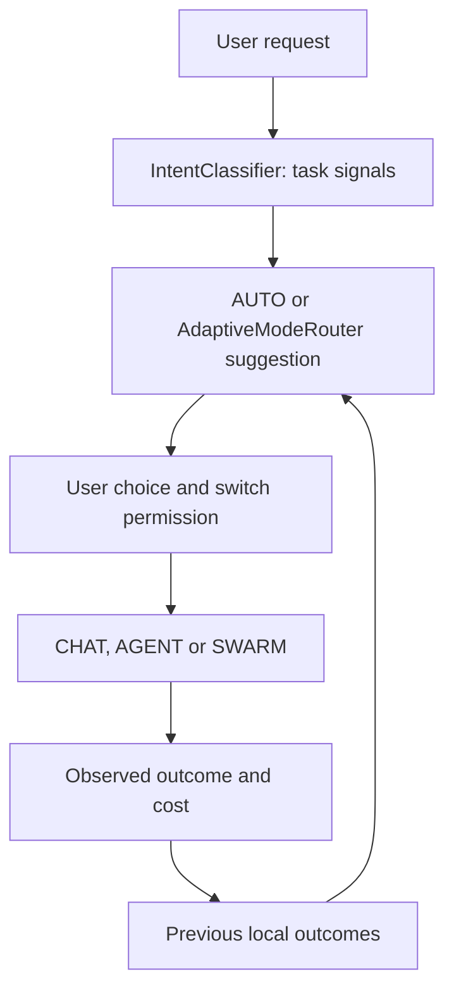

# OmniDev decision engine and local learning

> Routing recommendations and permission to switch modes are separate. Accuracy and cost claims require representative tasks and verified outcomes.

## Decision flow

Tool selection uses a bounded local catalog and on-demand loading, followed by mandatory preflight validation, enforced read-only worker restrictions and sequential recovery when needed. See the [tool execution contract](docs/TOOL_EXECUTION_CONTRACT.md) for protocol details and limits.

| Component | Responsibility | Limit |
| --- | --- | --- |
| `IntentClassifier.kt` | Signals for execution, modification, verification, parallelism, breadth and scope | Cannot guarantee correct intent recognition |
| `AdaptiveModeRouter.kt` | Suggest Chat→Agent/Team, Agent→Team after suitable stalls, or Team→Agent when parallelism adds little | Does not grant switch permission |
| `ModeSwitchPermissionStore.kt` | User-controlled switch permissions and limits | Does not infer outcome quality |
| `ModeOutcomeLearner.kt` | Aggregate outcomes by task shape and mode, with token/time costs when available | Does not store raw request text in the decision log or send weights to a server |
| `ModeDecisionModel.kt` | Incremental local success estimates from bounded numerical signals | Not a language model or embedding model; small samples are unreliable |
| `AgentDecisionPolicy.kt` | Step priorities and tool-result size limits | Does not alter Android permission policies |

## Mode selection and switching

`OmniMode.kt` defines `AUTO`, `CHAT`, `AGENT` and `SWARM`. An explicit execution request in Chat can suggest a working mode; independent work and real parallelism can favor Team. Agent escalation is unhelpful for shared infrastructure failures, tasks awaiting user action or indivisible work. One or two sequential tasks can favor Agent over Team. Suggestions carry confidence and short reasons, while application follows the independent permission path. Page content and tool results cannot authorize a switch.

`TeamExecutionPolicy` classifies parallel-execution safety, `TeamBudgetAllocator` allocates budgets, and `SwarmOrchestrator` coordinates planning, workers and synthesis. Adding workers does not automatically accelerate sequential work.

## Small local model

`ModeDecisionModel` uses local logistic regression with **12 dimensions**: bias, execution intent, modification, verification, parallelism, breadth, structural complexity, code, device, research, domain count and bounded request length. Per-mode weights update with a small learning step, regularization and value bounds. Verified success has more weight than an unverified success claim; environment failures can distort labels. Weights are stored in `SharedPreferences`; this does not train a general model or upload requests for training.

`ModeOutcomeLearner` retains success/failure/stopped statistics with a prior, average iterations, time and tokens when available, a bounded set of task groups and a circular decision log. Its advisory confidence adjustment is bounded to ±0.12. Agent/Team cost comparisons require outcomes for both modes in the same task group. Model-based recommendations require **at least 12 observations per mode**, a prediction margin, no material success regression and acceptable cost. The comparison path without model predictions requires **at least 6 observations per mode** and actual token costs. Missing data falls back to the baseline.

**Measurement limits:** coarse task groups can mix different work; unverified success is not quality evidence; token counts may be unavailable; device-local preferences can reset. Before changing thresholds, define acceptance measures for verified success, time, tokens, tool-call count and unwanted suggestions by task class, including English and Arabic requests.

## Code retrieval and bounded context

- `RepoIndexer` indexes local files and symbols with size/count limits and protection against path and symlink escapes.
- `RepoContextEngine` connects the index to context requests. `LocalCodeRetriever` ranks lexical matches, paths and symbol names, returning short snippets with file/line references through `repo_find_context`. It does not use general-purpose embeddings.
- `ToolSchemaCompactor`, `ContextCompressor`, `TeamHandoffCompressor` and `AgentDecisionPolicy` reduce definitions and text passed across turns and workers.

These limits may reduce context costs when the relevant code is retrieved. Savings and accuracy improvements need A/B measurement on fixed tasks with failures logged and outputs verified. Short snippets can omit dependencies; read the original file before sensitive edits.

## Code review entry points

| Goal | Path |
| --- | --- |
| Classification | `app/src/main/java/com/omnidev/workspace/domain/engine/IntentClassifier.kt` |
| Suggestions and permission | `domain/engine/AdaptiveModeRouter.kt`, `domain/engine/ModeSwitchPermissionStore.kt` |
| Learning | `domain/engine/ModeOutcomeLearner.kt`, `domain/engine/ModeDecisionModel.kt` |
| Execution | `domain/engine/AgentPipeline.kt`, `domain/engine/SwarmOrchestrator.kt` |
| Context | `data/repo/RepoIndexer.kt`, `data/repo/LocalCodeRetriever.kt`, `data/tools/RepoContextTools.kt` |
| Tests | `app/src/test/java/com/omnidev/workspace/domain/engine/`, `app/src/test/java/com/omnidev/workspace/data/repo/` |

Abbreviated `domain/` and `data/` paths start at `app/src/main/java/com/omnidev/workspace/`.
