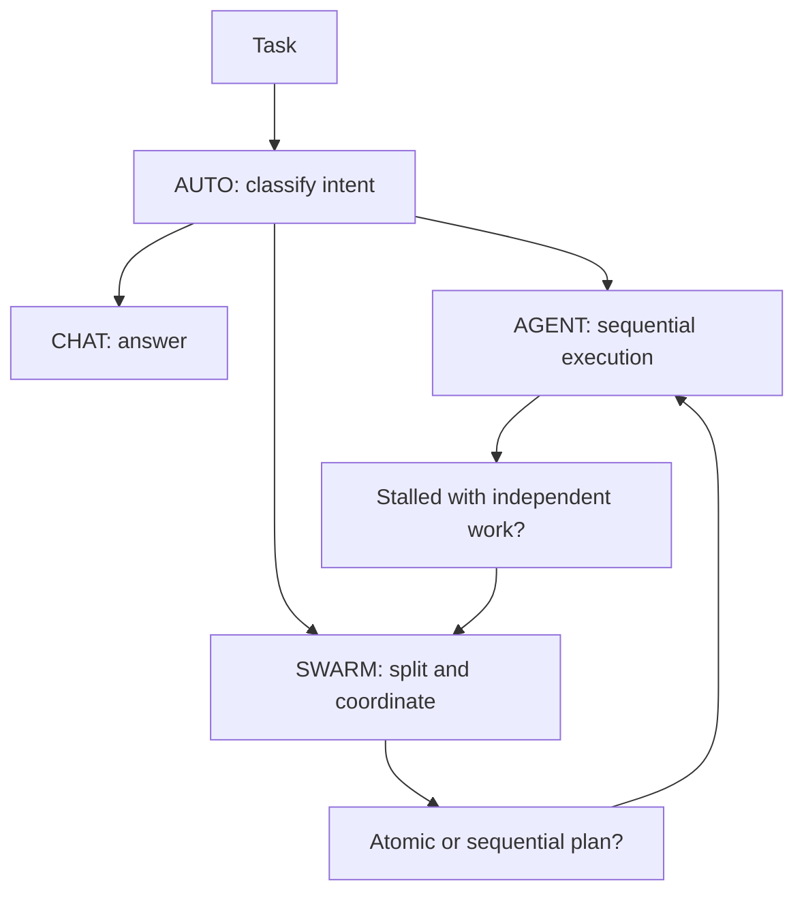

# OmniDev Workspace quick mental map

Entry points and execution paths. See [README](README.md) for measured counts, [architecture](PROJECT_ARCHITECTURE.md) for responsibilities and the [file guide](docs/PROJECT_FILES.md) for navigation.

## Where to start

| Question | Entry point |
| --- | --- |
| Where does a user request enter? | `ui/chat/ChatViewModel.kt`, then `domain/engine/` |
| How is the mode chosen? | `OmniMode.kt`, `IntentClassifier.kt`, `AdaptiveModeRouter.kt` |
| When does a team run? | `SwarmOrchestrator.kt`, `TeamExecutionPolicy.kt` |
| Who permits switching? | `ModeSwitchPermissionStore.kt` and the user's choice |
| Where are outcomes learned? | `ModeOutcomeLearner.kt`, `ModeDecisionModel.kt` |
| Where are tools exposed? | `data/tools/CompositeToolManager.kt`, `TierToolGate.kt` |
| Where does repository context come from? | `data/repo/RepoIndexer.kt`, `LocalCodeRetriever.kt` |
| Where are messages stored? | `data/db/OmniDevDatabase.kt` (Room v17) |
| Where is assistant access configured? | `ui/assistant/DeviceAccessActivity.kt`, `data/tools/PermissionManagerTool.kt` |
| Who verifies access state? | `DeviceAccessCatalog.kt`, `PermissionRequestPlan.kt`, `core/policy/` |
| Who maintains the floating session? | `data/assistant/AssistantRuntime.kt`, `AssistantController.kt` |
| Where are build variants configured? | `app/build.gradle.kts`, `app/src/{lite,norm,pro,oem,admin}/` |

Abbreviated source paths start at `app/src/main/java/com/omnidev/workspace/`.

## Mode flow

Switch recommendations require permission. Some failures need infrastructure repair or user action. Local outcome learning advises routing after enough observations; it does not replace authorization. See [the decision engine](DECISION_ENGINE.md).

## Practical invariants

- Five build flavors: `lite`, `norm`, `pro`, `oem`, `admin`; four execution modes: `AUTO`, `CHAT`, `AGENT`, `SWARM`.
- Room is **v17**. Gradle currently has one `:app` module; additional modules are a [proposal](MODULARIZATION_ROADMAP.md).
- `repo_find_context` returns bounded local evidence with file/line references. History recall returns source text with IDs; inspect the source when uncertain.
- Build policy, Android grants and connected integrations determine tool availability.
- Use `python3 scripts/repository_stats.py` for an exact committed snapshot and `python3 scripts/tool_catalog.py` for built-in tool/skill counts.
