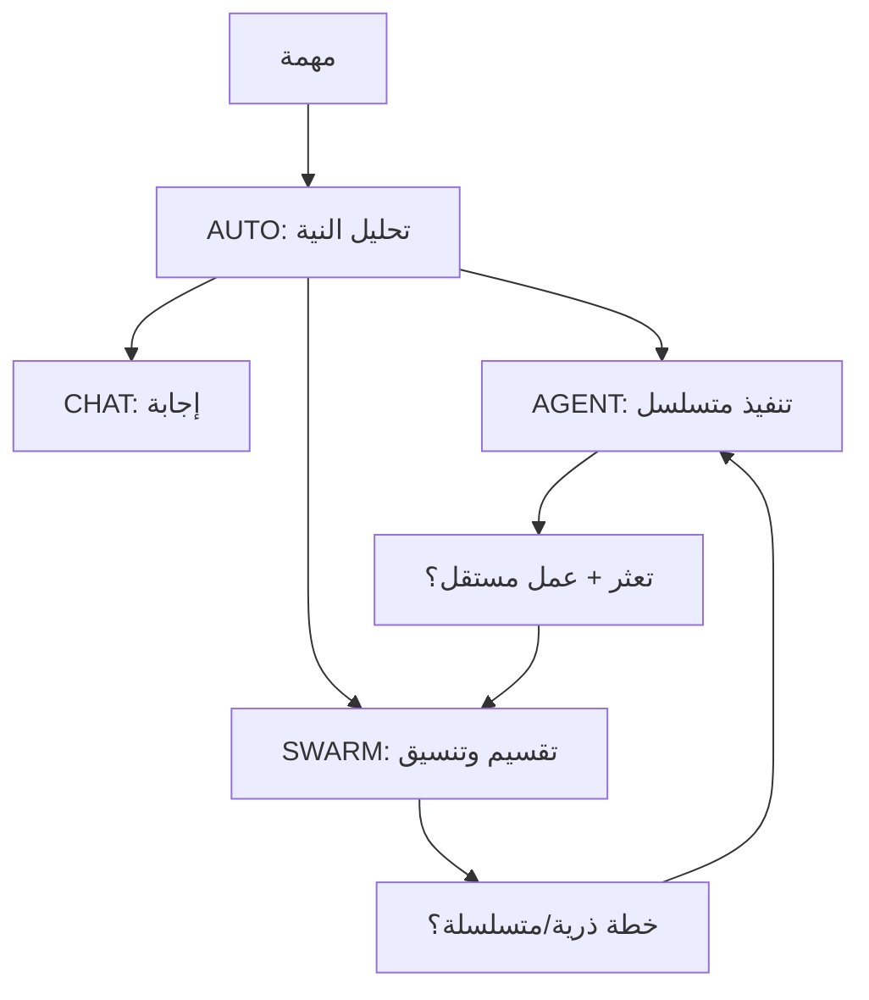

# خريطة ذهنية سريعة لـ OmniDev Workspace

> دليل سريع لنقاط الدخول ومسارات التشغيل. الأرقام وطريقة حسابها في [README](README.md)، والبنية في [PROJECT_ARCHITECTURE.md](PROJECT_ARCHITECTURE.md)، وتصنيف الملفات في [دليل المشروع](docs/PROJECT_FILES.md).

## أين أبدأ؟

| السؤال | نقطة الدخول |
|---|---|
| أين يدخل طلب المستخدم؟ | `ui/chat/ChatViewModel.kt` ثم `domain/engine/` |
| كيف يختار الوضع؟ | `OmniMode.kt`, `IntentClassifier.kt`, `AdaptiveModeRouter.kt` |
| متى يعمل فريق؟ | `SwarmOrchestrator.kt`, `TeamExecutionPolicy.kt` |
| من يسمح بالتبديل؟ | `ModeSwitchPermissionStore.kt` واختيار المستخدم |
| أين يتعلم من النتيجة؟ | `ModeOutcomeLearner.kt`, `ModeDecisionModel.kt` |
| أين تظهر الأدوات؟ | `data/tools/CompositeToolManager.kt`, `TierToolGate.kt` |
| من أين يأتي كود المستودع؟ | `data/repo/RepoIndexer.kt`, `LocalCodeRetriever.kt` |
| أين تحفظ الرسائل؟ | `data/db/OmniDevDatabase.kt` (Room v17) |
| أين أجهز صلاحيات المساعد؟ | `ui/assistant/DeviceAccessActivity.kt` و`data/tools/PermissionManagerTool.kt` |
| من يتحقق من حالة الوصول؟ | `DeviceAccessCatalog.kt`, `PermissionRequestPlan.kt`, `core/policy/` |
| من يحافظ على الجلسة العائمة؟ | `data/assistant/AssistantRuntime.kt`, `AssistantController.kt` |
| أين تضبط النسخ؟ | `app/build.gradle.kts` و`app/src/{lite,norm,pro,oem,admin}/` |

كل المسارات المختصرة للكود أعلاه تبدأ من `app/src/main/java/com/omnidev/workspace/` ما لم يذكر خلاف ذلك.

## تدفق الحالات

التوصيات في الأسهم الأخيرة تعتمد على إذن التحويل؛ بعض الفشل يحتاج إصلاح البنية أو تدخل المستخدم بدل زيادة الوكلاء. التعلم المحلي يساعد القرار بعد وجود نتائج كافية ولا يبدل الصلاحية. التفاصيل الرقمية في [DECISION_ENGINE.md](DECISION_ENGINE.md).

## ثوابت عملية

- خمس نسخ بناء (`lite`, `norm`, `pro`, `oem`, `admin`) وأربع قيم تشغيل (`AUTO`, `CHAT`, `AGENT`, `SWARM`).
- قاعدة Room الحالية **v17**. المشروع Gradle `:app` واحد، مع فصل مقترح فقط في [خطة التفكيك](MODULARIZATION_ROADMAP.md).
- `repo_find_context` يعيد أدلة كود محلية مختصرة مع ملف وسطور؛ استرجاع التاريخ يعيد نصوصًا مع معرفات مصدر؛ اقرأ المصدر عند الشك.
- لا تستنتج توفر أداة من اسمها وحده: نسخة البناء، منح Android، وربط التكامل هي التي تحسم الإتاحة.
- للمقياس الفعلي شغّل `python3 scripts/repo_metrics.py`؛ لا تستخدم أرقام الوثائق التاريخية أو إحصاءات غير مرتبطة بلقطة Git.
