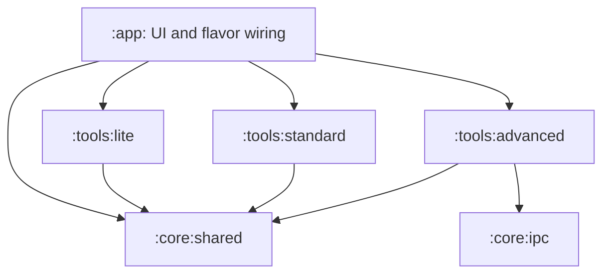

# OmniDev Workspace modularization roadmap

> **Proposed design, September 29, 2026.** `settings.gradle.kts` currently includes only `:app`. Five flavors (`lite/norm/pro/oem/admin`) and shared sources (`liteNorm/proOem/proOemAdmin`) exist today. The diagram is a possible target, not the current module layout. See [current architecture](PROJECT_ARCHITECTURE.md) and [repository counts](README.md#repository-size-and-source-statistics).

## Motivation

UI, storage, policies, device tools and integrations share one module. Separation could clarify dependencies and isolate privileged capabilities between flavors, but it also changes AIDL, manifests, KSP and source paths. Migrate in buildable stages. Moving a file alone does not prevent privileged access in Lite; runtime policies and manifests still enforce boundaries.

## Proposed structure



| Proposed module | Responsibility | Separation requirement |
| --- | --- | --- |
| `:core:shared` | Tool contracts, domain models and shared policies | No UI or flavor-specific Android service dependency |
| `:core:ipc` | OmniLink/AIDL contracts | Stable packages, signatures and peer identity |
| `:tools:lite` | Consumer-facing tools | Review declarations and permissions, not just tool names |
| `:tools:standard` | Broader-use tools | Put privileged calls behind an interface |
| `:tools:advanced` | Privileged device integrations | Explicit Pro/OEM/Admin wiring and denied-access tests |
| `:app` | Compose, Application and flavor setup | Preserve user choices and routing |

This is a partitioning hypothesis. Extract the real dependency graph before moving `AgentPipeline`, Room or `CompositeToolManager`. Smaller contracts can prevent Gradle cycles between DAOs, service interfaces and UI.

## Migration steps

1. Inventory sources with `python3 scripts/repo_metrics.py`. Review Gradle configuration, flavor sources, imports, manifest services, AIDL and KSP dependencies.
2. Move independent interfaces and model code into `:core:shared` with appropriate unit tests. Keep Context-dependent Android implementations in place until their interfaces are clear.
3. Move AIDL contracts while preserving package paths, interface names, binding requirements and external callers. Test reconnect and process loss.
4. Register module tools through `ToolContribution`; route contributions through `CompositeToolManager` while retaining `TierToolGate` and confirmation policies. Reject duplicate names and silent routing conflicts.
5. Move tool families in small batches and make each flavor dependency explicit. Inspect merged manifests and APK contents so an unprivileged flavor cannot reach privileged execution through an alternate route.
6. Build and test all five flavors, chat recall, repository context, local decisions and OmniLink before merging.

## Acceptance checks

```sh
./gradlew :app:compileLiteDebugKotlin :app:compileNormDebugKotlin :app:compileProDebugKotlin :app:compileOemDebugKotlin :app:compileAdminDebugKotlin
./gradlew :app:testLiteDebugUnitTest :app:testNormDebugUnitTest :app:testProDebugUnitTest :app:testOemDebugUnitTest :app:testAdminDebugUnitTest
./gradlew :app:lintLiteDebug :app:lintNormDebug :app:lintProDebug :app:lintOemDebug :app:lintAdminDebug
```

Inspect merged permissions, APK execution paths and policy behavior without root or Shizuku. APK-size and build-speed goals require a measured baseline on the same device and configuration. Room migration acceptance includes opening data from a previous version; JVM tests alone do not cover it.
