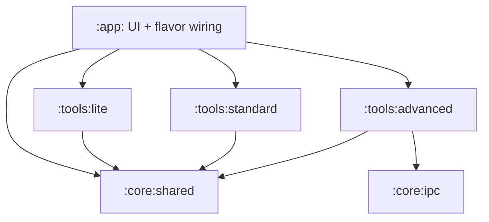

# خطة فصل وحدات OmniDev Workspace

> **الحالة: تصميم مقترح، 29 سبتمبر 2026.** `settings.gradle.kts` يضم `:app` فقط. خمس نسخ بناء موجودة (`lite/norm/pro/oem/admin`) ومجلدات مشاركة (`liteNorm/proOem/proOemAdmin`). الرسم التالي هدف محتمل، وليس وحدات مبنية حاليًا. راجع [المعمارية الحالية](PROJECT_ARCHITECTURE.md) و[أرقام المستودع](README.md#المشروع-بالأرقام).

## لماذا نفصل؟

المشروع يجمع واجهة المستخدم، قاعدة البيانات، السياسات، أدوات الجهاز والتكاملات في وحدة واحدة. الفصل قد يوضح حدود الاعتماد ويتيح عزل القدرات المميزة بين flavors، لكنه يغير AIDL وmanifest وKSP ومسارات المصدر معًا. ينبغي تنفيذه على مراحل قابلة للبناء، دون افتراض أن نقل ملف وحده يمنع وصول أداة غير مناسبة لنسخة Lite؛ سياسة التشغيل وبيان التطبيق يظلان جزءًا من الحماية.

## المخطط المستهدف



| الوحدة المقترحة | المسؤولية | شرط الفصل |
|---|---|---|
| `:core:shared` | عقود الأدوات، نماذج المجال، السياسات المشتركة | لا يعتمد على UI أو خدمة Android خاصة بنسخة |
| `:core:ipc` | عقود وواجهات OmniLink/AIDL | تثبيت package والتواقيع وهوية الطرف الآخر |
| `:tools:lite` | أدوات متاحة لمسارات المستهلك | مراجعة التصريحات والأذونات، لا مجرد أسماء الأدوات |
| `:tools:standard` | أدوات الاستخدام الأوسع | فصل استدعاءات القدرات المميزة خلف واجهة |
| `:tools:advanced` | تكاملات الجهاز المميزة | ربط Pro/OEM/Admin المقصود، واختبار فشل الصلاحية |
| `:app` | Compose وApplication وتهيئة النسخ | تحافظ على خيارات المستخدم وتوجيه الأدوات |

هذه القائمة **فرضية تقسيم**؛ استخرج رسم الاعتماد الحقيقي قبل نقل `AgentPipeline` أو Room أو `CompositeToolManager`. خلط DAO مع واجهات الخدمات أو واجهة UI قد يخلق دورات Gradle؛ عالجها بعقود أصغر.

## خطوات التنفيذ

1. **جرد حقيقي:** شغّل `python3 scripts/repo_metrics.py`، اقرأ `settings.gradle.kts` و`app/build.gradle.kts` وملفات `app/src/*/`، واجمع استيرادات الوحدات وخدمات Manifest وAIDL واعتماد KSP. تجنب قوائم مسارات ثابتة تصبح قديمة.
2. **العقود المشتركة:** انقل واجهات وأكواد نموذج مستقلة إلى `:core:shared` مع اختبارات وحدة مناسبة؛ ابق تطبيقات Android التي تحتاج Context في مكانها حتى توجد واجهة واضحة.
3. **IPC:** انقل عقود AIDL مع مراعاة مسار الحزمة وأسماء الواجهات ومتطلبات الربط والمستدعين الخارجيين. اختبر إعادة الاتصال وفقدان العملية.
4. **مساهمات الأدوات:** عرّف تسجيل أدوات لكل وحدة عبر `ToolContribution`، ثم اجعل `CompositeToolManager` يوزع على المساهمين مع حفظ `TierToolGate` وسياسات التأكيد. امنع تضارب أسماء الأدوات والتوجيه الصامت.
5. **فصل القدرات:** انقل مجموعات الأدوات على دفعات صغيرة، وثبّت اعتماد كل flavor المقصود؛ تحقق من manifest النهائي وAPK، وتأكد أن النسخ غير المميزة لا تحتفظ بمسار تنفيذ مميز عن طريق آخر.
6. **تدقيق التكامل:** أعد بناء واختبار الأنواع الخمسة واسترجاع المحادثات وسياق المستودع والقرار المحلي وOmniLink قبل الدمج.

## بوابات قبول

```bash
./gradlew :app:compileLiteDebugKotlin :app:compileNormDebugKotlin :app:compileProDebugKotlin :app:compileOemDebugKotlin :app:compileAdminDebugKotlin
./gradlew :app:testLiteDebugUnitTest :app:testNormDebugUnitTest :app:testProDebugUnitTest :app:testOemDebugUnitTest :app:testAdminDebugUnitTest
./gradlew :app:lintLiteDebug :app:lintNormDebug :app:lintProDebug :app:lintOemDebug :app:lintAdminDebug
```

افحص أذونات merged manifests والمسارات الموجودة داخل كل APK، ونتائج السياسات عند غياب root أو Shizuku. أي هدف لحجم APK أو سرعة بناء يحتاج baseline مقاسًا من نفس الجهاز والإعدادات قبل أن يصبح معيار قبول. يتطلب ترحيل Room اختبار فتح بيانات إصدار سابق؛ نجاح اختبارات JVM وحده لا يغطي ذلك.
