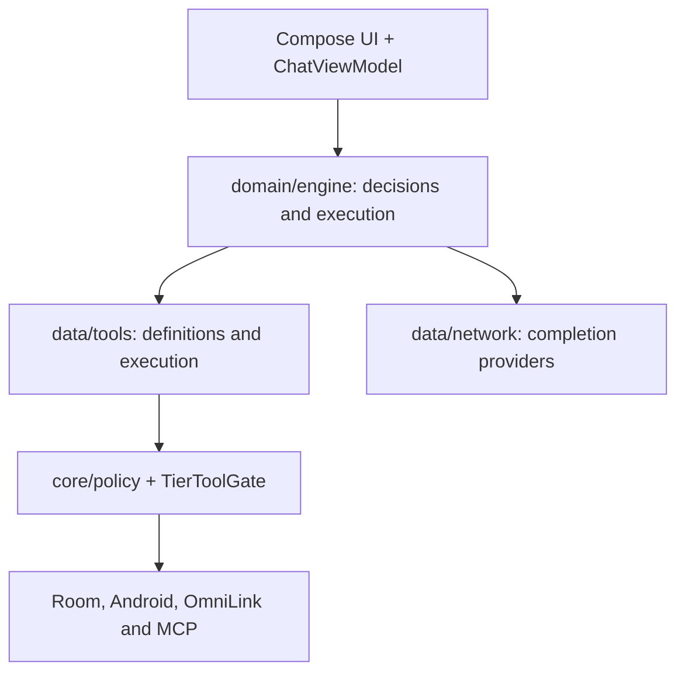

# OmniDev Workspace architecture

The project has one Gradle module, `:app`, with five build flavors. See [README](README.md) for counts and their method, and the [file guide](docs/PROJECT_FILES.md) for navigation.

## Runtime layers

Paths below start at `app/src/main/java/com/omnidev/workspace/`.

| Area | Location | Examples |
| --- | --- | --- |
| Application UI | `ui/`, `MainActivity.kt`, `OmniDevApp.kt` | Chat, providers, settings, browser |
| Floating assistant | `ui/assistant/`, `data/assistant/` | Session, window, voice, bubble, Android settings return |
| Access management | `data/tools/PermissionManagerTool.kt`, `DeviceAccessCatalog.kt`, `PermissionRequestPlan.kt`, `AppOpAccessPlan.kt` | Permission discovery, special access setup, app AppOps and grant verification |
| Agent execution | `domain/engine/` | `AgentPipeline`, `SwarmOrchestrator`, `AgentRuntime` |
| Mode decisions | `domain/engine/` | `IntentClassifier`, `AdaptiveModeRouter`, `ModeOutcomeLearner` |
| Tools | `data/tools/`, `core/tools/` | `CompositeToolManager`, `TierToolGate`, `RepoContextTools` |
| Code context | `data/repo/` | `RepoIndexer`, `RepoContextEngine`, `LocalCodeRetriever` |
| Storage | `data/db/`, `data/repository/` | `OmniDevDatabase` (Room v17) and DAOs |
| Models and networking | `data/model/`, `data/network/`, `registry/` | Model request configuration and completions |
| Build capabilities | `core/policy/`, `core/privileged/`, `app/src/<flavor>/` | Policies, manifest overrides and privileged execution |

## Execution decisions

`AUTO` classifies requests, `CHAT` produces direct completions, `AGENT` runs a tool loop and `SWARM` coordinates planning and workers. `AdaptiveModeRouter` can recommend upgrades or fallback with reasons and bounded confidence. `ModeSwitchPermissionStore` and the user's selection control permission. [DECISION_ENGINE.md](DECISION_ENGINE.md) explains signals, local learning and sample limits.

`CompositeToolManager` routes tool definitions through `TierToolGate` and execution/permission guards. Source definitions do not guarantee availability in Lite or on an unprivileged device. Untrusted page and notification content must not become authorization instructions. The [catalog](docs/TOOL_AND_SKILL_CATALOG.md) distinguishes built-in names from dynamically discovered MCP tools.

## Storage and evidence retrieval

Room v17 stores chats, system knowledge, execution logs, memories, repository symbols, scheduled tasks and shared memory. Chat recall uses original messages and source IDs; see [recall limits](CHAT_HISTORY_RECALL.md). Code retrieval indexes a selected scope and returns local snippets with file/line references. A retrieved snippet does not prove that the rest of a file is irrelevant.

## Flavors and privileged integrations

`app/build.gradle.kts` defines `lite`, `norm`, `pro`, `oem`, `admin`, with shared source sets `liteNorm`, `proOem`, `proOemAdmin`. `TierPolicy`, `ConfirmationGate` and `core/privileged/` define application boundaries; actual Android grants, a companion application and Shizuku/root availability remain separate. Admin is intended for internal testing. See [the link protocol](LINK_PROTOCOL.md) and [OmniLink v3](OMNILINK_V3_INTEGRATION.md).

Five `.aidl` files are tracked. Similar names alone do not imply duplication: package, signatures and callers determine each interface. Removing or merging contracts requires caller analysis and builds of the affected flavors.

## Assistant access setup

`DeviceAccessActivity` shows ordinary/special permissions and root, Shizuku, rish, system and Device/Profile Owner status. `PermissionManagerTool` discovers permissions from the merged manifest and device definitions; `PermissionRequestPlan` separates background grants. `DeviceAccessCatalog` checks special access and installed components rather than inferring access from a flavor name.

`AssistantInputActivity` connects access setup to the floating session through Activity Result. `PermissionRequestBridge` uses a foreground activity for Android prompts. `AssistantFlavorPolicy` enables permission inspection/request and OmniLink tools; `ChatViewModel` adds a fresh access snapshot to assistant context. Privileged grants follow confirmation, audit and readback verification. See [DEVICE_ACCESS.md](DEVICE_ACCESS.md).

## Change and validation map

| Change | Review | Initial validation |
| --- | --- | --- |
| New tool | `core/tools/`, `data/tools/CompositeToolManager.kt`, `TierToolGate.kt` | Flavor visibility, consent and success/failure paths |
| Mode policy | `domain/engine/`, `ui/chat/ChatViewModel.kt` | Classifier, engine and user-choice precedence tests |
| Room table | `data/db/OmniDevDatabase.kt`, entities/DAOs | Migrations and opening older databases |
| Permission or service | Main and flavor manifests | Android prompts and affected-flavor behavior |
| OmniLink integration | `data/ipc/`, `LINK_PROTOCOL.md` | Peer identity, permissions and Binder size |

[MODULARIZATION_ROADMAP.md](MODULARIZATION_ROADMAP.md) proposes `:core:*` and `:tools:*` modules. `settings.gradle.kts` currently declares only `:app`; the proposal is not a map of existing modules. Every affected flavor must build during a future migration.
