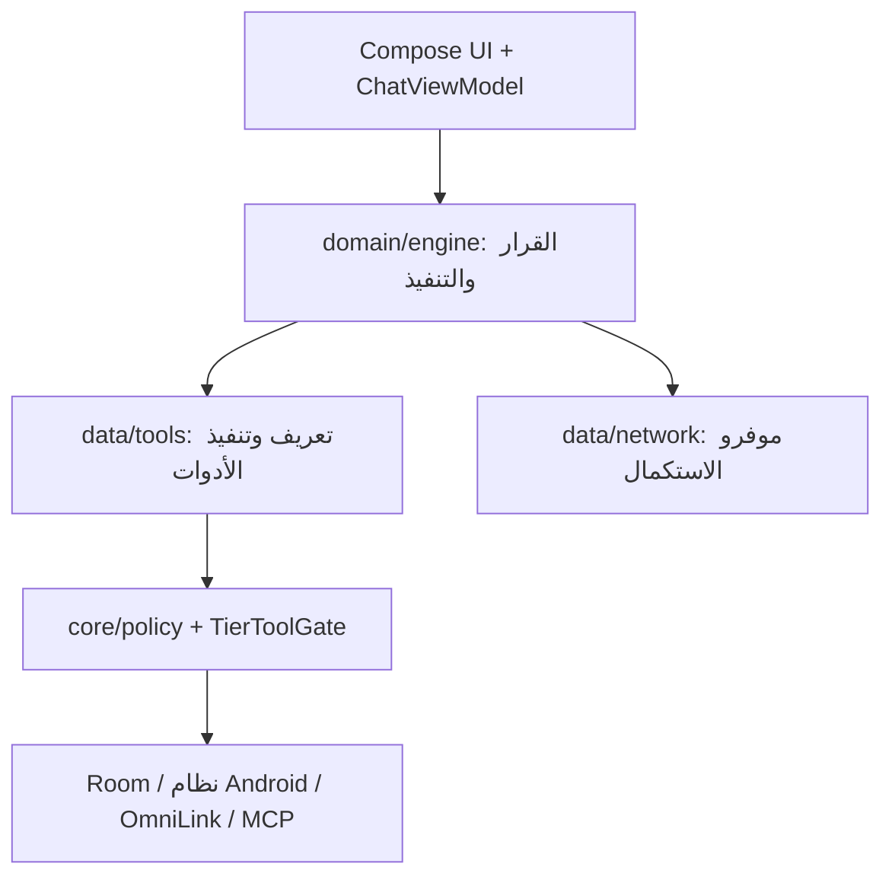

# معمارية OmniDev Workspace

> وصف بنية التطبيق ومسؤولياته. الإحصاءات وطريقة عدّها في [README](README.md)، وتصنيف الملفات في [دليل المشروع](docs/PROJECT_FILES.md). المشروع وحدة Gradle واحدة `:app` بخمس نسخ بناء.

## طبقات التشغيل

| الجزء | موضعه تحت `app/src/main/java/com/omnidev/workspace/` | أمثلة |
|---|---|---|
| واجهة التطبيق | `ui/`, `MainActivity.kt`, `OmniDevApp.kt` | المحادثة والموفرون والإعدادات والمتصفح |
| المساعد العائم | `ui/assistant/`, `data/assistant/` | الجلسة، النافذة، الصوت، الكورة والعودة من إعدادات Android |
| إدارة الوصول | `data/tools/PermissionManagerTool.kt`, `DeviceAccessCatalog.kt`, `PermissionRequestPlan.kt` | اكتشاف الصلاحيات، تهيئة الوصول الخاص والتحقق من المنح |
| سير الوكيل | `domain/engine/` | `AgentPipeline`, `SwarmOrchestrator`, `AgentRuntime` |
| قرار الوضع | `domain/engine/` | `IntentClassifier`, `AdaptiveModeRouter`, `ModeOutcomeLearner` |
| الأدوات | `data/tools/`, `core/tools/` | `CompositeToolManager`, `TierToolGate`, `RepoContextTools` |
| سياق الكود | `data/repo/` | `RepoIndexer`, `RepoContextEngine`, `LocalCodeRetriever` |
| التخزين | `data/db/`, `data/repository/` | `OmniDevDatabase` (Room v17) وDAOs |
| النماذج والشبكة | `data/model/`, `data/network/`, `registry/` | إعداد استدعاءات النموذج وتوليد الاستكمال |
| صلاحيات البناء | `core/policy/`, `core/privileged/`, `app/src/<flavor>/` | السياسات، Manifest overrides، التنفيذ المميز |

## قرار التنفيذ

`AUTO` يصنف الطلب، `CHAT` يقدم إكمالًا مباشرًا، `AGENT` يشغّل دورة أدوات واحدة، و`SWARM` ينظم خطة وعدة عمال. عند الحاجة يقترح `AdaptiveModeRouter` الترقية أو الرجوع بمبررات وحدود ثقة. يظل السماح بالتبديل في `ModeSwitchPermissionStore` واختيار المستخدم. [DECISION_ENGINE.md](DECISION_ENGINE.md) يشرح الإشارات، النموذج المحلي، عينات التعلم وقيودها.

توجيه الأداة يتم عبر تعريفاتها و`CompositeToolManager` ثم `TierToolGate` وحواجز السياسة والتشغيل. التعريفات في المصدر ليست وعدًا بتشغيل كل الأدوات في Lite أو على جهاز بلا صلاحيات. لا تدخل بيانات غير موثوقة من صفحة أو إشعار كتعليمات تفويض.

## التخزين واسترجاع الأدلة

`OmniDevDatabase.kt` يعلن Room v17 ويضم تاريخ المحادثة، معرفة النظام، سجل الأدوات، الذاكرة، فهرس الرموز، الجدولة، والذاكرة المشتركة. استرجاع المحادثة يعتمد نص الرسائل الأصلي ومراجع ID؛ [حدوده](CHAT_HISTORY_RECALL.md). استرجاع الكود يبدأ بالفهرسة داخل نطاق مختار ثم ترتيب مقاطع محلية بمرجع ملف وسطور. استرجاع مقتطف ليس إثباتًا بأن بقية الملف لا تؤثر في الحل.

## flavors والتكامل المميز

`app/build.gradle.kts` يعلن `lite`, `norm`, `pro`, `oem`, `admin`، مع مصادر مشتركة `liteNorm`, `proOem`, `proOemAdmin` وحزم/خصائص Manifest حسب الحاجة. `core/policy/TierPolicy` و`ConfirmationGate` وفصل `core/privileged/` يحددون الحدود؛ صلاحيات Android الفعلية وتوفر تطبيق مقابل أو Shizuku/Root شيء منفصل. Admin مخصص للاختبار الداخلي واسع الصلاحيات. قواعد البروتوكول في [LINK_PROTOCOL.md](LINK_PROTOCOL.md) وتكامل [OmniLink v3](OMNILINK_V3_INTEGRATION.md).

**AIDL:** يوجد خمسة ملفات `.aidl` متتبعة. لا نفترض أن وجود اسمين متشابهين عيب ازدواج؛ يحدد اسم الحزمة والتوقيع والاستخدام كل واجهة. أي حذف أو دمج يتطلب فحص المستدعين وبناء نسخ التطبيق المتأثرة. توافق الحزمة والتوقيع والمستدعين يحدد سلامة العقد.

## صلاحيات المساعد ومسار التهيئة

`DeviceAccessActivity` يعرض الصلاحيات العادية والخاصة وحالة الروت وShizuku وrish والنظام وDevice/Profile Owner. `PermissionManagerTool` يكتشف التصريحات من الـmerged manifest وتعريفات الصلاحيات على الجهاز، ويفصل منح الخلفية باستخدام `PermissionRequestPlan`. `DeviceAccessCatalog` يراجع الوصول الخاص والمكوّنات المثبتة بدل استنتاج الإذن من اسم نسخة البناء.

`AssistantInputActivity` يربط صفحة الوصول بالجلسة العائمة عبر Activity Result، و`PermissionRequestBridge` يستخدم Activity أمامية لإظهار طلبات Android. `AssistantFlavorPolicy` يتيح أدوات فحص الصلاحيات وطلبها وOmniLink، و`ChatViewModel` يضيف لقطة وصول حديثة لسياق المساعد. منح صلاحية مميزة يمر بالموافقة المناسبة وسجل التدقيق، ثم بفحص قراءة الإذن بعد التنفيذ. التفاصيل في [DEVICE_ACCESS.md](DEVICE_ACCESS.md).

## خريطة التغيير والتحقق

| التغيير | راجع | تحقق مبدئي |
|---|---|---|
| أداة جديدة | `core/tools/`, `data/tools/CompositeToolManager.kt`, `TierToolGate.kt` | إتاحة النسخ، موافقة المستخدم، فشل/نجاح الأداة |
| سياسة وضع | `domain/engine/`, `ui/chat/ChatViewModel.kt` | اختبارات المصنّف والمحرك وأسبقية اختيار المستخدم |
| جدول Room | `data/db/OmniDevDatabase.kt`, entities/DAO | هجرة البيانات واختبار النسخ القديمة |
| صلاحية أو Service | `app/src/main/AndroidManifest.xml` وmanifest النسخة | تأكيدات Android واختبار flavor المحدد |
| تكامل OmniLink | `data/ipc/`, `LINK_PROTOCOL.md` | هوية الطرف الآخر، الصلاحيات، حجم Binder |

### خطة بنيوية مستقبلية

[MODULARIZATION_ROADMAP.md](MODULARIZATION_ROADMAP.md) تصف نقلًا مقترحًا إلى `:core:*` و`:tools:*`. `settings.gradle.kts` يعلن حاليًا `:app` فقط؛ لا تعتمد على المخطط المستقبلي وكأنه ملفات موجودة. تحقق Gradle لكل flavor شرط أساسي عند تنفيذ النقل.
