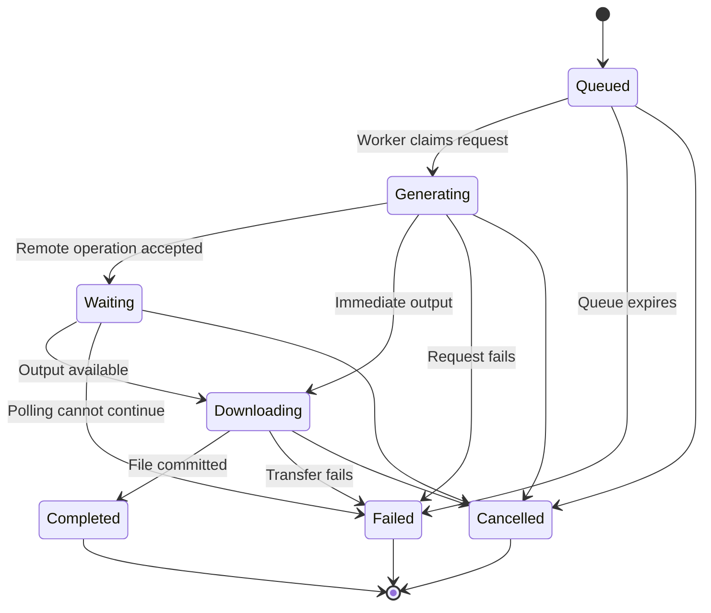
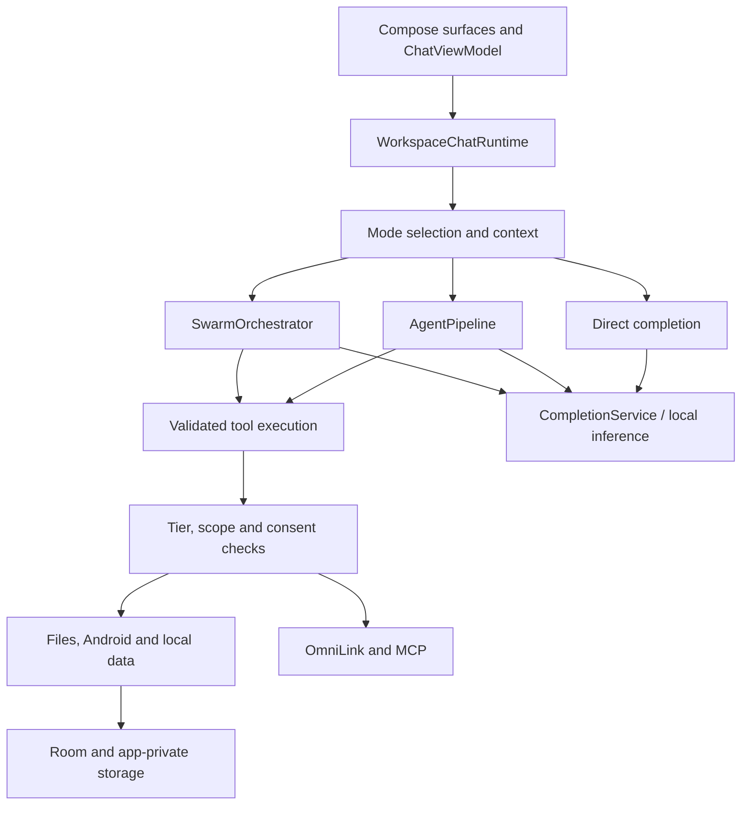

# OmniDev Workspace

### An Android AI workspace for conversation, tool execution, local knowledge and connected apps

[](https://github.com/obieda-hussien/OmniDev-Workspace/actions/workflows/android-ci.yml)
[](https://github.com/obieda-hussien/OmniDev-Workspace/actions/workflows/security-gate.yml)

**OmniDev Workspace brings a configurable AI assistant, an agent runtime and a developer workspace onto an Android device.** It combines ordinary conversation, tool-assisted tasks, coordinated agent teams, source-backed conversation recall, local code retrieval, reusable learned tasks, profile reference photos, a locally learning virtual companion, on-screen assistance and integrations with the Omni ecosystem.

Choose your providers and models, choose the task scope, and decide which tools and device capabilities are available. The application can answer a question, inspect a local project, carry out a supported action, coordinate independent investigations, or replay an approved local routine without calling a language model.

The repository contains the Android application, native inference integration, JVM and Android tests, build automation, a companion WhatsApp bridge and technical documentation. It is under active development. Source availability, a declared capability and a successful unit test each describe a different thing; actual operation depends on the installed edition, Android version, granted access, connected services and model account.

**Developer and maintainer:** [Abdelrahman Hussein / Obieda](https://github.com/obieda-hussien). Original authors of dependencies, connected applications and inherited components retain their credits and rights. See [Attribution](ATTRIBUTION.md), [Third-party notices](THIRD_PARTY_NOTICES.md) and [Licensing status](LICENSE.md).

**Development collaboration:** early work was assisted by Claude, Gemini, Jules and GitHub Copilot; continued development with ChatGPT / OpenAI Codex brought extensive debugging, interface redesign and code/logic revision. See [Contributors and development history](CONTRIBUTORS.md).

**Start here:** [Quick start](#quick-start) · [Choose an edition](#editions-and-capability-policy) · [Build from source](#build-from-source) · [Documentation map](#documentation-map) · [Authorized development](CONTRIBUTING.md) · [Get help](SUPPORT.md) · [Report a vulnerability](SECURITY.md)

> This README describes the implementation reviewed on **9 October 2026**. Current source and completed CI results take precedence over older planning documents. OmniDev Workspace is **proprietary**, with publicly visible source and controlled development. Rights in original project material are reserved; see [LICENSE.md](LICENSE.md) before any reuse or distribution.

## Contents

- [Repository size and source statistics](#repository-size-and-source-statistics)
- [What OmniDev Workspace does](#what-omnidev-workspace-does)
- [Quick start](#quick-start)
- [Editions and capability policy](#editions-and-capability-policy)
- [Conversation and execution modes](#conversation-and-execution-modes)
- [Model providers and configuration](#model-providers-and-configuration)
- [Conversation experience](#conversation-experience)
- [Tool and skill mentions](#tool-and-skill-mentions)
- [Profile and reference photos](#profile-and-reference-photos)
- [Virtual companion](#virtual-companion)
- [Live agent follow-ups](#live-agent-follow-ups)
- [Images, video, music and attachments](#images-video-music-and-attachments)
- [On-screen assistant](#on-screen-assistant)
- [Hi Omni and local voice](#hi-omni-and-local-voice)
- [Device access and lock-screen behavior](#device-access-and-lock-screen-behavior)
- [Learned tasks and reusable skills](#learned-tasks-and-reusable-skills)
- [Architecture and request lifecycle](#architecture-and-request-lifecycle)
- [Tool discovery and execution contracts](#tool-discovery-and-execution-contracts)
- [Team planning and concurrency](#team-planning-and-concurrency)
- [Repository context and developer tools](#repository-context-and-developer-tools)
- [Local Git and GitHub access](#local-git-and-github-access)
- [Memory, history and local learning](#memory-history-and-local-learning)
- [OmniLink and connected applications](#omnilink-and-connected-applications)
- [MCP and external tools](#mcp-and-external-tools)
- [Messaging and service integrations](#messaging-and-service-integrations)
- [Android tools and scheduling](#android-tools-and-scheduling)
- [Data, privacy and trust boundaries](#data-privacy-and-trust-boundaries)
- [Interface motion and device performance](#interface-motion-and-device-performance)
- [Build from source](#build-from-source)
- [Testing and validation](#testing-and-validation)
- [CI, artifacts and signing](#ci-artifacts-and-signing)
- [Troubleshooting](#troubleshooting)
- [Project layout and source navigation](#project-layout-and-source-navigation)
- [Documentation map](#documentation-map)
- [Current limits and development directions](#current-limits-and-development-directions)
- [Contributing, support and repository maintenance](#contributing-support-and-repository-maintenance)
- [Ownership, licensing and acknowledgments](#ownership-licensing-and-acknowledgments)

## Repository size and source statistics

This reproducible snapshot counts committed content at `211149522fd3545e93e4690c0139d82eaed3762a` on **9 October 2026**, including profile reference photos, reply personalization, tool/skill mentions, independent selected-skill context budgets, the locally learning virtual companion, English project prose, built-in catalog counts and the five MCP defaults. The following statistics-only update is not included in that fixed snapshot.

| Metric | Count |
| --- | ---: |
| Tracked files | 803 |
| UTF-8 text files | 791 |
| Physical text lines | 132,409 |
| Nonblank text lines | 119,136 |
| Source/script files | 665 |
| Source/script physical lines | 123,409 |
| App Kotlin files, including tests | 634 |
| App Kotlin physical lines, including tests | 119,735 |
| Test source files | 156 |
| Test source physical lines | 12,551 |
| Tracked blob bytes | 6,906,422 |

Physical lines include comments and blank lines; nonblank lines still include comments. These counts are not comment-free SLOC, a code-quality score or a device performance measurement. Source/script counts exclude XML/resources, data and documentation. Test totals overlap source totals. Untracked/generated files, downloaded models, caches and submodule contents are excluded; tracked binary assets count as files/bytes only.

See the [full format breakdown and counting method](docs/REPOSITORY_STATS.md). To measure any committed revision without counting local caches:

```sh
python3 scripts/repository_stats.py --ref HEAD --format markdown
```

The source catalog contains **150 unique local tool definitions**, or **148 names after excluding two hidden legacy aliases**, and **6 bundled agent skills**. Counts cover all registered optional providers and God Mode definitions; actual session visibility depends on edition and capability settings. Connected MCP tools and runtime discovery/mode helpers are additional. See the [complete catalog and reproducible count](docs/TOOL_AND_SKILL_CATALOG.md).

For repository access, installed integrations, Actions controls and public-source limitations, see [Repository security](docs/REPOSITORY_SECURITY.md).

## What OmniDev Workspace does

OmniDev is organized around a shared conversation and execution environment. The main workspace, floating assistant and connected-app entry points reuse application services while retaining their own session and authorization boundaries.

| Area | Current implementation | What you need |
|---|---|---|
| Conversation | Configurable text models, streaming replies, saved sessions, reply context and attachments | A configured remote provider or a supported local model |
| Single-agent work | A bounded planning/tool/observation loop with runtime validation and visible activity | An edition and task scope that permit the requested tools |
| Agent teams | Coordinator planning, worker execution, shared budgets and evidence-based handoff | Independent work suitable for delegation and configured model assignments |
| Code context | Local repository indexing, symbol lookup and ranked excerpts with file/line references | A readable local project and a selected scope |
| Conversation recall | Search and paging over original locally saved messages | Existing records in the device database |
| Persistent knowledge | Knowledge snippets, execution history, episodic records and lessons | Local storage; configured model access when interpretation is required |
| Learned tasks | Reviewed, versioned recipes with local replay and decision checkpoints | User approval, reliable selectors and current tool/device permissions |
| Screen assistant | Native Android assistant panel, optional restoration bubble and shared agent runtime | Assistant role; additional access for live screen actions |
| Local voice | Custom wake phrase, few-shot acoustic enrollment, Vosk recognition and offline Android TTS | Compatible edition, microphone access and explicitly installed speech/voice assets |
| Media generation | Independently configured image, video and music jobs with persistent cards | A selected supported media provider/model and account access |
| Profile personalization | Name/background, reply style, warmth, enthusiasm, formatting, emoji and an opt-out switch | Save preferences in Settings → Your profile |
| Reference photos | A local face photo and full-body photo, preview/replace/remove, reference-aware image generation | Enable reference use and select a supported Gemini image or OpenAI GPT Image model |
| Virtual companion | Little Omni motion, expressions, local neural learning and persistent habits | Enable the companion in Settings; no remote model or extra overlay permission |
| Capability mentions | Search tools/installed skills from `@` in the editor and prioritize them for the current turn | Enabled capabilities and installed skills; existing authorization still applies |
| App interoperability | OmniLink capability discovery, receiver-enforced trust and bounded context exchange | Compatible apps, verified identity and the required local consent |
| External tools | MCP clients and configured service integrations | A reachable server/account and applicable tool permissions |
| Device operations | Supported Accessibility, intents, notifications, terminal and privileged backends | Edition eligibility plus actual Android/backend authorization |

### Example workflows

**Understand a project:** select a local repository as Target Context, index it, ask where a behavior is implemented, inspect the retrieved file references and request a scoped change in Agent mode. Source retrieval reduces how much unrelated code must be sent to the model; it does not replace reading the implementation or running checks.

**Investigate several independent problems:** use Team mode when separate components can be examined independently. Read workers can run concurrently. Mutations and tools whose effects are unknown are serialized under the runtime's policy.

**Continue a task while it runs:** send a follow-up such as “Use Kotlin instead” or “Also verify the Arabic layout.” The existing task retains completed work and execution evidence while the remaining plan is revised.

**Reuse a demonstrated action:** teach or capture a task, review its selectors and expected outcomes, approve the recipe, then run it by its exact trigger or the local Run control. Fully supported recipe steps need no language-model request. Uncertain steps pause for help.

**Generate media:** enable the desired media type in Model Selection and request it from Chat, Agent or Team. The generated file belongs to the originating conversation, with an explicit job state rather than a simulated completed output.

**Ask from another app:** invoke Omni through Android's assistant gesture or a launcher question handoff. Public launcher input becomes a draft; privileged connected-app operations use a separate authenticated capability path.

## Quick start

### 1. Obtain a suitable build

Use APK artifacts from a completed [Android CI run](https://github.com/obieda-hussien/OmniDev-Workspace/actions/workflows/android-ci.yml), or [build your selected edition](#build-from-source). Check the revision, edition and signing identity before installing. CI artifacts and a published release are different distribution surfaces; this README does not promise a store listing or a continuously available packaged release.

The minimum declared Android version is **Android 7.0 / API 24**. The current compile and target SDK are **36**. Features introduced by newer Android versions remain conditional. Lite and Standard target `arm64-v8a`; native-enabled editions also include `x86_64` in the build configuration. Consult [the edition matrix](#editions-and-capability-policy) before choosing an APK.

Admin is an internal developer testing identity and is excluded from public APK artifact delivery. OEM is intended for properly provisioned system integration; sideloading an OEM APK does not grant system privileges.

### 2. Configure a text provider

Open the **Providers** screen, configure the relevant API key or supported account connection, refresh its catalog when appropriate and choose text models in **Model Selection**. Custom OpenAI-compatible servers need an explicit base URL. GitHub Copilot/Models credentials and **GitHub Agent Access** serve separate purposes.

A configured key does not prove that every listed model is accessible. Check the provider/account, selected model, quota and capability metadata if a request fails. Remote model usage is billed and governed by that provider; the application does not include an API subscription.

### 3. Start with a small task

Use Chat for an explanation. For a file or device task, select Agent and establish a concrete Target Context where applicable. Enable the tools required for the task and inspect any action preview before approval. Team is useful for independent work rather than automatically preferable for every request.

A useful initial repository question is:

```text
Inspect this project and explain its entry points. Cite the files you actually read.
Do not modify anything yet.
```

After reviewing the evidence, request a specific change and the relevant verification. Avoid interpreting a fluent answer or a green tool-discovery result as proof that a mutation succeeded.

### 4. Enable optional capabilities deliberately

| Goal | Setup surface | First check |
|---|---|---|
| Generate images/video/music | Settings → Model Selection → Media generation | The individual type is enabled and its selected account/model is usable |
| Use Omni over another app | AI Settings → Omni on your screen | Omni is selected as the default Android digital assistant |
| Read/control the visible UI | Device access | Supported edition and connected Accessibility service |
| Use a restoration bubble | Screen-assistant/device access settings | Overlay access and successful bubble attachment |
| Use a local wake phrase | Voice activation | Enrollment completes, microphone access is present and listening is explicitly started |
| Speak and hear local commands | Voice activation | A local recognition model and offline Android TTS voice are installed |
| Replay a learned task | Settings → Agent Skills → Learned tasks | Recipe reviewed, approved and enabled |
| Access GitHub repositories | Integrations & Linked Accounts → GitHub Agent Access | Separate repository credentials and the intended read/write mode |
| Connect an Omni app | OmniLink integration/settings | Compatible app, verified signer and receiver consent |
| Receive Telegram requests | Telegram integration | A paired private owner chat and foreground listener |
| Run a local WhatsApp bridge | WhatsApp Bridge integration | Same-phone loopback bridge, bearer key and linked own-account chat |

The exact wording of navigation labels may evolve. The linked feature guides explain prerequisites and implementation boundaries in greater detail.

## Editions and capability policy

The Android application has one Gradle module, `:app`, and five product flavors in the `tier` dimension. Shared packages under `core/`, `domain/`, `data/` and `ui/` are application architecture layers, not separate Gradle modules.

| Flavor | Display name | Application ID | Intended use |
|---|---|---|---|
| `lite` | OmniDev Lite | `com.omnidev.workspace` | Reduced device access, conversation, retrieval and supported knowledge/media tools |
| `norm` | OmniDev Standard | `com.omnidev.workspace.norm` | Ordinary device assistance with Accessibility and terminal tooling |
| `pro` | OmniDev Pro | `com.omnidev.workspace.pro` | Privileged tooling, local inference and advanced authorized workflows |
| `oem` | OmniDev OEM | `com.omnidev.workspace.oem` | Provisioned OEM/system integration |
| `admin` | OmniDev Admin | `com.omnidev.workspace.admin` | Internal broad-capability developer testing |

Separate application IDs mean separate installations and app data. Installing another edition does not automatically transfer conversations, credentials or learned recipes. In particular, older Admin builds using the base package are not silently migrated into `.admin`.

### Compile-time capability flags

This table reflects `app/build.gradle.kts` and the `TierPolicy` contract. A **Yes** enables the application path; it does not supply the corresponding Android permission, root session, backend, entitlement or connected-app grant.

| Capability | Lite | Standard | Pro | OEM | Admin |
|---|---|---|---|---|---|
| Root backend eligibility | No | No | Yes | No | Yes |
| Shizuku backend eligibility | No | No | Yes | No | Yes |
| Accessibility eligibility | No | Yes | Yes | Yes | Yes |
| Deep-security tooling flag | No | No | Yes | No | Yes |
| Device-admin wipe flag | No | No | Yes | No | Yes |
| Local llama.cpp inference | No | No | Yes | Yes | Yes |
| System-integration flag | No | No | No | Yes | Yes |
| Automatic application confirmation | No | No | No | Yes | Yes |
| Continuous local wake/enrollment | No | Yes | Yes | Yes | Yes |
| Configured native ABI set | arm64 | arm64 | arm64 + x86_64 | arm64 + x86_64 | arm64 + x86_64 |

Tools are additionally filtered by `TierToolGate`, chat capability preferences, assistant policy and backend checks. A family appearing in this table is not an exhaustive per-tool availability list. For example, a tool catalog can expose a definition while its own backend still refuses a disallowed or unsupported operation.

Lite uses an explicit tool allowlist. Standard removes the Pro-only tool group. OEM excludes Shizuku-dependent operations and relies on properly provisioned system paths. Calls are checked again at dispatch; hiding a tool in the UI is not the only boundary.

OEM/Admin automatic confirmation applies to the application's normal tier gates and is audited. It does **not** automatically grant separately authenticated lock-screen scopes, another application's local consent or operating-system access. Admin's package identity also does not make an ordinary APK a platform-signed system application.

Shared flavor sources include `liteNorm/`, `proOem/` and `proOemAdmin/`; manifests can remove or override components for individual editions. The Shizuku library remains on the shared main dependency classpath, even though runtime access and manifest components are flavor-gated. Physical dependency isolation is a development direction, not a completed modularization claim.

## Conversation and execution modes

The UI can refer to a coordinated team as **Team**; the corresponding internal execution mode is `SWARM`.

| Mode | Behavior | Suitable requests |
|---|---|---|
| `AUTO` | Classifies the request and chooses an execution route under switching policy | Mixed workloads where a preliminary routing choice is useful |
| `CHAT` | Direct conversational completion, with explicitly supported and permitted auxiliary paths | Questions, explanations and ordinary discussion |
| `AGENT` | One agent performs a bounded sequence of tool proposals and observations | Interdependent tasks, repository changes and supported device operations |
| `SWARM` / Team | A coordinator distributes a plan and combines worker evidence | Several independent components or investigations |

Chat is not the full agent loop, but it can use supported web/media paths when enabled. An Agent run is not guaranteed to call a tool on every iteration. Team adds planning and coordination overhead; more workers do not automatically improve a task that is fundamentally sequential.

### Adaptive routing and local outcome learning

`IntentClassifier` extracts execution, modification, verification, breadth, parallelism and domain signals. `AdaptiveModeRouter` considers these signals together with run state and practical team structure. `ModeSwitchPermissionStore` separates a recommendation from permission to switch. Explicit user selection remains important.

`ModeDecisionModel` is a small local model with twelve numeric features and bounded incremental updates. `ModeOutcomeLearner` records outcomes and available latency, repetition and token evidence in local preferences. The stored decision history is not a raw prompt archive. Outcome learning influences recommendations within defined bounds rather than changing the permissions of a task.

An infrastructure failure, denied access or a task requiring user input is not resolved simply by adding more agents. Sparse samples and unverified success reports are weak training evidence. This mechanism is local outcome-guided adaptation, not chat-model fine-tuning or a benchmarked guarantee of the best mode.

See [Decision engine](DECISION_ENGINE.md) for feature signals, safeguards, learning boundaries and evaluation considerations.

## Model providers and configuration

### Text-completion paths

`CompletionService` implements an Anthropic-specific message path, OpenAI-compatible completion paths, streaming handling and local execution routing. The code contains provider configurations for OpenAI, Anthropic, Gemini, xAI, DeepSeek, Mistral, Groq, Cerebras, Cohere, Together, Fireworks, Perplexity, NVIDIA, MiniMax, Vercel AI Gateway, Hugging Face, GitHub Copilot, GitHub Models, OpenRouter, ZenMux, Z.AI and a custom OpenAI-compatible endpoint, plus Local Edge.

These are implemented adapter/configuration entries, not a promise of identical features or current account availability across every provider. Catalog IDs, account permissions, native tool support, vision support, reasoning controls and billing can differ. The selected provider's actual response and capability metadata govern a request.

| Configuration | Purpose | Practical distinction |
|---|---|---|
| Provider connection | Store an API key or supported account identity | A saved credential is separate from a successful authenticated request |
| Model catalog | Enumerate built-in or provider-returned model entries | An entry is not proof of entitlement or quota |
| Text-model assignment | Choose conversation, agent and team-role models | Team configuration can add planner/worker costs |
| Custom endpoint | Point an OpenAI-compatible provider at a configured base URL | Server compatibility and data handling remain the server operator's responsibility |
| Media-model assignment | Choose independent image/video/music providers | Text/vision input support does not establish generation support |
| Local Edge | Use the native local inference path in eligible editions | Requires a real native build, a usable model file and adequate memory |

### Local inference

The application integrates C++/JNI with the `llama.cpp` submodule. Lite and Standard disable the native inference build path. Pro, OEM and Admin enable local SLM eligibility and native ABIs, but still need a valid model and a successfully built native implementation.

The Gradle setup attempts to initialize the submodule before a native build. If initialization fails, its fallback may compile a stub. A stub library or enabled flag is not proof that on-device inference is available. Initialize the pinned submodule explicitly for a reproducible native build, and check the produced APK and runtime.

Local inference performance depends on model size, quantization, context length, ABI, CPU and available memory. This repository does not publish verified latency, memory or quality numbers for every model/device combination. Local inference and local voice are independent features: installing a Vosk speech model does not install a chat model.

### Cost and credentials

The application records token/cost evidence when available and exposes analytics. Providers may omit usage metadata, use different accounting, or continue billing an accepted request after local cancellation. Estimates should be distinguished from a provider invoice.

GitHub Copilot/Models access is for model completion; GitHub Agent Access is for repository operations. A provider API key is not a repository permission, and a repository token is not automatically a model subscription. Changing an application preference does not enlarge a credential's service-side authorization.

For a storage-focused description, read [Privacy](PRIVACY.md). Provider API keys currently use a dedicated app-private Preferences DataStore; this is **not** a blanket claim that every credential store is Keystore-encrypted.

## Conversation experience

### Saved sessions and evidence

Conversations and messages are persisted in the local Room database. Sessions can carry source context for in-app, connected-app and messaging workflows. Message references and original text support later retrieval; a saved assistant assertion is still an assertion that should be checked against current tool or repository state.

The main chat and floating assistant use separate controllers backed by shared repositories. Starting a floating conversation does not overwrite the main chat's next-message draft. A fresh assistant invocation starts a new conversation, while minimization and activity-result handoffs preserve the current invocation.

### Editing and regeneration

Use **Edit last message → Save & regenerate** for the latest user turn, or **Regenerate last response** for the latest answer. The replacement applies within the same saved conversation across Chat, Agent, Team and the assistant.

- The current selected mode and Target Context govern the replacement execution.
- Attachments and reply context belonging to the edited turn are retained.
- The prior turn's responses, console activity and media outputs are replaced together.
- A draft prepared for the next request is retained.
- Editing is disabled while an execution or file import is active; cancelling the edit leaves the stored turn unchanged.
- Failed generation remains an explicit failure rather than an indefinitely active replacement.

Turn replacement updates the database transactionally. Late media from a superseded turn revision cannot overwrite the replacement, while unrelated earlier media jobs keep their own identity. Regeneration launches a new execution; completed file/device/service side effects do not automatically roll back and can occur again if requested again.

### Reading long replies

The chat follows the latest content while the user remains at the bottom. Dragging into history pauses automatic following; the jump-to-latest control resumes it. The composer accounts for keyboard insets, and saved console panels can be reopened with historical messages.

Markdown, code rendering and reply lookup reuse work when their inputs have not changed. Streaming still changes text and therefore still requires rendering updates. Very large messages should be profiled on real devices rather than assumed to be free because caching exists.

## Tool and skill mentions

Type `@` in the message editor and select tools or installed skills from the searchable suggestions. A message can combine up to 12 tools and 4 skills, with removable selection chips:

```text
@tool:github_manager @skill:omnidev-quality-gate Review the failed build.
```

Mentions load the selected schemas/guidance early and prioritize them for that turn. **They are priority hints:** the model can discover supporting tools when the task needs them. Disabled tools, edition policy and approval requirements still apply. Chat keeps its existing web/media tool boundary. Selection survives history, editing and regeneration; the next message has its own selection. The main chat and floating assistant share the composer. See [Tool and skill mentions](docs/chat-mentions.md).

## Profile and reference photos

Settings → **Your profile** saves your nickname, background/custom preferences and reply style. Choose Default, Friendly, Professional, Direct or Detailed, then tune warmth, enthusiasm, headings/lists and emoji. **Personalize replies** controls whether these saved fields enter new Chat, Agent and Team prompts. Save changes applies these text settings; turning personalization off retains your saved values. It does not clear conversation history or existing memories.

Add a clear front-facing **Face photo** and a **Full-body photo** with your head and feet visible. Each slot supports a preview, replacement and removal; changes to photos save immediately. The app creates a bounded, orientation-correct JPEG with the original metadata removed in private, backup-excluded storage. It uses the system picker and does not require a new permission to scan your gallery.

**Use for images of me** starts off. Enable it, select a supported image model in Model Selection, and request your likeness, for example “Create a professional portrait of me using my reference photos” or “Make a full-body image of me in a new outfit.” The media tool includes the selected face/body files only for reference-enabled requests. Gemini receives image parts; OpenAI GPT Image uses image editing with multipart inputs. Ordinary text prompts contain no reference photo bytes or paths. This is appearance conditioning, not face recognition or training a personal model; likeness depends on the provider.

Reference generation currently supports **images with Gemini image and OpenAI GPT Image**. Video, music, xAI and OpenRouter reference requests return a clear unsupported message without silently dropping references or switching providers. Consent and file selection are rechecked before submission: disabling use, removing or replacing a photo blocks queued jobs with the old selection. An upload already sent to a provider cannot be recalled by removing the local photo. See [Profile personalization and reference photos](docs/PROFILE_PERSONALIZATION.md).

## Virtual companion

**Little Omni** is the lilac native companion shared by the main chat and floating assistant. It hops between safe composer/message/console surfaces, follows the caret and touches with its eyes, reacts to run events, and supports petting, dragging, flinging, temporary hiding and rescue before departure. Layout accounts for physical RTL/LTR coordinates, small windows, lifecycle and reduced motion.

Its local learning combines two small trainable neural networks inspired by EE-Net, bounded experience replay, contextual priors, novelty and decaying moods. Explicit More/Less feedback and gentle placement teach habits; ordinary taps and missing feedback are not reward labels. Weights, familiarity and learned preferences persist across chats and app restarts in backup-excluded storage. Settings control visibility, roaming, learning, moods, personality and resting corner; reset clears learned memory. It does not call a remote model, read conversation text or claim consciousness. See [Virtual companion](docs/virtual-companion.md) for the implementation, artwork and validation scope.

## Live agent follow-ups

A running Agent, Team or floating-assistant task accepts text corrections through **Send follow-up**. **Stop** remains a separate cancellation control.

```text
Use the existing settings design.
Also test portrait and landscape with the phone language set to Arabic.
Keep the database schema unchanged.
```

The follow-up joins the current task and is saved as another user message. Received/applied indicators describe its progress. Ordered updates retain the original objective; a later correction overrides an earlier conflicting requirement.

At the runtime boundary, a follow-up interrupts model generation and retry waits. Actions from an obsolete revision that have not started are skipped. Already-running tools settle under their existing timeouts; the application cannot promise to undo an external operation already accepted by a backend.

Team workers share the revised instruction generation. The coordinator waits for the previous wave, retains completed-task and public tool evidence, then replans remaining work within the same logical budget. Private reasoning and partial model drafts are not carried as verified execution evidence.

Current follow-ups are text-only, with per-message and per-run bounds. Remove pending attachments before sending a live correction. Local learned routines retain their own pause/resume boundary; a correction during routine execution requests a pause between steps before model continuation.

See [Live agent steering](docs/LIVE_AGENT_STEERING.md) for revision sealing, persistence order, concurrency barriers and limits.

## Images, video, music and attachments

### Configure each generation type separately

Open **Settings → Model Selection → Media generation**. Image, video and music/song generation each start **Off**. A type must be explicitly configured and enabled before its tool/worker can generate output.

| Type | Implemented generation families in the current source | Controls and qualifications |
|---|---|---|
| Image | Gemini, OpenAI, xAI and OpenRouter models declaring image output | Supported aspect ratio, resolution, quality, format and provider-specific output options |
| Video | Gemini Veo and xAI Grok Imagine | Supported duration/resolution/aspect ratio; audio where supported |
| Music/song | Gemini Lyria and the MiniMax music account path | Vocals/instrumental, lyrics, language, style and supported format; timing/tempo can be prompt guidance |

The detailed feature guide records the currently implemented model families and contracts. Catalog suggestions do not guarantee provider access, and the application does not claim every model accepting image/video input can create images/video. Provider availability and billing must be checked for the actual configured account.

Each media type stores defaults, creative direction, content to avoid, permitted chat overrides, readiness announcement preferences and optional device saving. Jobs snapshot settings at creation; later configuration changes affect new jobs. The agent cannot silently enable a disabled type or switch to another selected account.

Disabling a type cancels pending local jobs for that type. Removing a provider key does not authorize fallback to another provider. A remote job already accepted by a service can still consume quota after local cancellation.

### Persistent job lifecycle



A persistent job and its conversation card are created together with a usable request identity. WorkManager submits, polls where applicable, downloads within bounds and commits a complete file before the card becomes playable. A readiness or terminal-failure message is inserted once into the originating conversation. Deleted conversations are not recreated by late delivery.

Provider operation IDs are persisted for supported video jobs so status checks can resume without a second creation request. **Check existing job** checks a known remote operation. It is different from submitting a new billable request.

Unexpected exceptions, access/quota problems, invalid responses, worker interruption, missing files and stale scheduling are represented by curated terminal or recoverable job states. Raw provider response bodies and arbitrary exception strings are not presented as user diagnostics.

Interactive scheduling uses expedited work with a quota fallback. A visible request that has remained unstarted for more than five minutes can enter `QUEUE_TIMEOUT`; **Start now** restarts the local queued request under its retained identity. Requests with an uncertain already-submitted outcome are not automatically recreated through that action.

### Live presentation and playback

Active cards use type-specific decorative motion: image sheets, a moving video film strip, or a music equalizer and rings. The animation communicates activity; it is not generated preview content or an invented percentage. Reduced-motion settings freeze the scene, and compact devices use fewer primitives and a lower animation rate. Frame updates stop with the foreground lifecycle.

Cards appear beneath the current or saved run console. Images use sampled previews and a full-screen zoom/pan viewer. Videos open with explicit platform playback controls and visible codec errors. Audio supports play/pause, seeking, duration and stop, with a shared playback owner preventing overlapping chat audio.

### Import, save and share

Imported attachment files are copied into app storage so a temporary picker grant does not become the sole long-term file reference. A stored or previewable video does not establish that the selected text model can understand it. Model-bound image payloads are limited independently from file storage and display.

Supported readable file references include shared storage and the app's designated media/assistant attachment directories. Private credential data is excluded from automatic rendering/export. Public HTTPS media retrieval has bounded sizes and redirects, private-network checks and separate credential-free download handling.

On Android 10 and later, device saving uses pending MediaStore entries that are published only after a complete copy. Older Android uses a document picker. Sharing uses scoped FileProvider paths and temporary read grants. Optional generated-file saving targets Pictures/Omni, Movies/Omni and Music/Omni; a save failure preserves the conversation file for manual retry.

Read [Chat media and unlock recovery](docs/CHAT_MEDIA_AND_UNLOCK_RECOVERY.md) for provider controls, recovery semantics, output delivery and device acceptance checks.

## On-screen assistant

### Invocation and sessions

Select Omni as Android's default digital assistant and invoke the supported Home/assistant gesture. The native `VoiceInteractionSession` hosts a floating card above the current application. A supported optional bubble can minimize and restore the current session when overlay access is available.

The assistant shares the conversation renderer and agent execution stack, while using an app-private default file scope and assistant-specific policy. It receives a current access snapshot so missing prerequisites can be surfaced without guessing.

| Interaction | Behavior |
|---|---|
| New Home/assistant invocation | Start a new assistant conversation |
| Minimize to bubble and restore | Continue the same assistant invocation |
| File, voice or permission activity handoff | Retain session state and reject results belonging to an older invocation |
| Open a setup page | Preserve the running session while Android handles the user action |
| Submit a live correction | Continue the active task through the same steering path |
| Close explicitly | Cancel/close the current interaction under its normal lifecycle |

### Screen context and action approval

Screenshots, selected images, files and semantic Accessibility observations can provide evidence. They do not grant authority to perform unrelated actions. Android or another application's protected-window policy can prevent captures or hide overlays.

The action guard combines the current request, edition policy, tool settings, visible window state and action approval. Lite provides attached-context assistance without live UI control or the restoration bubble. Standard allows ordinary Accessibility assistance; Pro adds permitted privileged backends. OEM/Admin use their existing audited automatic application gates when the underlying capability is actually available.

The native assistant window is service-hosted. Attachment choices and action confirmation therefore render in its existing panel, avoiding assumptions about an Activity dialog token. A proposed file patch can expose its diff before approval. A successful request to start a bubble service does not itself prove that a bubble attached; execution waits for the attachment acknowledgment and checks the visible restoration path.

### Assistant lifecycle boundaries

The assistant looks through its own window to observe the target application rather than treating its own composer as the target. Activity-result bridges carry the current conversation generation. Missing handlers, rejected windows and failed bubble startup produce actionable results instead of silently authorizing actions.

Normal assistant conversation captures and private credential entry have different visibility rules. While locked, the private panel does not expose prior messages, attachments or console history. See [Screen assistant](docs/SCREEN_ASSISTANT.md) and [Floating assistant design](docs/floating-assistant-design.md).

## Hi Omni and local voice

### Enrollment and listening

Available in Standard, Pro, OEM and Admin. Lite excludes continuous microphone listening and the wake enrollment Activity, while retaining its ordinary assistant gesture path.

1. Open **Voice activation** under the screen-assistant settings.
2. Select Omni as the Android digital assistant and grant microphone access. Enable notification visibility for listening controls.
3. Keep **Hi Omni** or save a short custom phrase.
4. Record five positive examples of that phrase and two different short negative phrases.
5. Complete a fresh held-out validation recording. A successful flow ends at **Wake phrase ready**.
6. Start listening explicitly from the foreground settings page. Stop through settings or the persistent notification.
7. If wanted, enable local voice conversation, install the recognition language model and select an installed offline Android TTS voice.

Contrast recordings are not additional wake tests; they must differ from the selected phrase. Separation errors identify a recording to replace while retaining other examples. Bounded validation failures pause with explicit retry/retraining choices rather than demanding endless recordings. A saved profile remains available during retraining until its replacement passes.

Changing the phrase stops listening and replaces its acoustic profile. **Test saved wake phrase** evaluates a fresh sample without launching a conversation or retaining raw audio. Android permission grants alone neither enroll the phrase nor start listening.

### What the wake engine learns

The wake engine uses local 16 kHz mono PCM capture, energy-based segmentation, MFCC/delta features and bounded time-warp template matching. Five positives and two contrasts calibrate phrase separation; a separate coarse acoustic voice profile can influence matching. The validation sample is excluded from training.

It is an experimental few-shot acoustic classifier. It does not fine-tune a large speech model, verify that the recording literally contains the typed words, or supply a secure voice biometric. Similar voices, recordings, changed microphone distance and noise can produce failures or false matches. No measured false-accept rate or battery claim is published here.

Profiles are versioned, bounded and encrypted with device-local AndroidKeyStore keys under credential-encrypted `noBackupFilesDir`. Enrollment is user-operated on an unlocked protected Activity. Raw wake recordings stay transient and are cleared after extraction/cancellation. The agent has no tool to export a profile or silently enroll/start listening.

### Recognition and speech output

Command and private credential recognition use **Vosk** with direct `AudioRecord` PCM. The local path does not invoke Google's recognizer startup tones. Offline Android TTS voices speak prompts and responses; a missing or network-only voice is not silently accepted as offline output.

Recognition and speech alternate rather than recording over the assistant's own response. Wake capture pauses while a conversation is active and around calls, playback, consent changes and cooldowns. Ordinary unlocked dictation can still use a separately selected system voice input picker.

| Recognition model configured by the application | Language | Resource considerations |
|---|---|---|
| `vosk-model-small-en-us-0.15` | English | Approximately 40 MB download / 71 MB installed; preferable for constrained RAM |
| `vosk-model-ar-mgb2-0.4` | Arabic | Approximately 318 MB download / 665 MiB installed; substantially heavier |

These are source-configured downloads, not weights bundled into the repository or APK. Downloading is explicit, HTTPS-only, size-bounded and SHA-256 verified. Each language has a separate durable install. Staged replacement and resumable transfer preserve the prior valid installation. Arabic dialect and spelling quality still require device-specific evaluation.

### Android lifecycle

Listening uses a microphone foreground service with visible Stop controls. It is non-sticky: a reboot, force-stop or terminated service does not trigger a hidden automatic restart. Start it again from settings after unlock. Continuous software listening consumes battery and is not a hardware DSP hotword implementation.

Microphone privacy switches, while-in-use restrictions, assistant-role changes and OEM battery management can block capture or invocation. A native assistant invocation is preferred; a detected-phrase notification offers the supported fallback when the service is unavailable.

The chosen chat model remains separate from recognition. An ordinary spoken request can reach a remote completion provider after unlock if that is the selected model; “local voice” does not mean the entire assistant request is always offline.

See [Hi Omni local wake](docs/HI_OMNI_LOCAL_WAKE.md) for enrollment algorithms, model integrity checks, exact lifecycle limits and physical-device verification.

## Device access and lock-screen behavior

### Device access center

The access center discovers declarations in the installed merged manifest, reads actual grant state and exposes ordinary permissions, special access and available execution backends. Its bulk setup route coordinates applicable requests rather than assuming a fixed number of permissions can be granted on every Android device.

| Access class | Typical setup | Why it is separate |
|---|---|---|
| Runtime permission | Foreground Android permission dialog | Depends on OS version, declaration and current grant state |
| Special app access | Dedicated Android settings page | Overlay, all-files, notification, DND or similar access is not a normal permission batch |
| Accessibility | User enables the exact service | Required for eligible semantic UI operations |
| Input method | User selects/enables the application input path | An app cannot treat registration as activation |
| Shizuku | Running Shizuku and approved application access | Shell-identity backend, independent from root |
| Root | Available and authorized `su` backend | Root is not obtained by selecting Pro/Admin |
| System entitlement | Correct provisioning/signing/installation | An OEM package name does not create platform authority |
| Device/Profile Owner | Android-managed provisioning | Device administrator and owner roles have different privileges |
| Sensitive lock-screen scope | Explanation plus Android identity confirmation | Separately authenticated consent, disabled by default |

`PermissionRequestPlan` handles version-aware batching and background prerequisites. `DeviceAccessCatalog` examines installed components and service matches. Allowlisted own-app AppOps and privileged grants are read back after changes; an attempted command is not evidence that a grant succeeded.

A large manifest includes optional, privileged and API-specific declarations. Their presence does not establish implemented data collection or permit Android to grant signature permissions to an ordinary app. For example, the access center does not itself implement a Health Connect record reader or companion-device pairing merely because related access can be described.

### Separate lock-screen scopes

Lock-screen/sensitive scopes start disabled. Enable them through Device access with local explanation and Android identity confirmation. Revocation takes effect immediately; revoking all also deletes the locally saved PIN.

| Scope | Supported purpose | Important boundary |
|---|---|---|
| Wake the screen | Ask Android to turn on the display and verify interactive state | Display wake does not authenticate the user |
| Request Android unlock | Present native authentication and verify keyguard state | Android remains the credential authority |
| Assistant on lock screen | Show the private native/translucent assistant host | Existing conversation content stays hidden |
| Inspect lock screen | Observe permitted semantic controls | Raw dumps, screenshots and general credential readers are blocked while locked |
| Operate sensitive Settings | Supported observations/interactions with Android Settings | Protected-window and credential restrictions remain |
| Use a saved local PIN | Admin-only encrypted local vault and explicitly selected permit | Supported genuine SystemUI PIN controls; no guessing or arbitrary shell input |
| Enter spoken code locally | Offline PIN, spelled password or numbered pattern with explicit confirmation | One supported native submission; no transcript or cloud credential fallback |

### Unlock routing and authorization duration

`device_admin(action=request_unlock)` chooses one authentication route: an authorized saved PIN, a configured private voice session, private local code entry where permitted, or Android's native prompt. A failed selected credential attempt does not cascade into another credential attempt.

The saved-PIN vault supports a **15-minute one-shot permit** or **remembered authorization until revoked**. Failed or interrupted remembered input pauses further attempts until the user resumes authorization. Remembered authorization is tied to the installation and device-local encrypted storage; removing the PIN, clearing app data or uninstalling revokes that local state.

Private voice/local entry keeps codes out of chat, model arguments, tool output, clipboard and learned tasks. A spoken PIN is not voice biometric authentication; anyone hearing or replaying it can possess the credential. Unsupported keypads or low-confidence recognition require user handoff. Android's actual unlocked state establishes success, even when native callbacks arrive in a different order.

### Screen wake and platform limits

With the relevant consent, a lock-screen assistant/authentication session holds the display for up to **120 seconds** using a monotonic lease. Host changes and recreation preserve the original deadline. Explicit screen-off, unlock, close or revoked grants release it.

Root, Shizuku, Device Admin and a matching application signer do not invent a missing lock credential. First unlock after reboot is controlled by Android; credential-encrypted application data is unavailable beforehand. Protected system pages can hide overlays, and OEM keypads can differ from supported native controls. Physical keyguard testing is still required for the intended phone.

Read [Device access](DEVICE_ACCESS.md), [Device lock access](docs/DEVICE_LOCK_ACCESS.md) and [Private unlock recovery](docs/CHAT_MEDIA_AND_UNLOCK_RECOVERY.md).

## Learned tasks and reusable skills

### Three distinct mechanisms

| Mechanism | What it stores | Model use |
|---|---|---|
| Prompt skill / `SKILL.md` | Guidance for a model's task behavior | Usually interpreted by a model |
| Task manager/todo item | A tracked task description/state | Not itself an executable recipe |
| Learned task | Reviewed, versioned actions/selectors and decision checkpoints | Local replay needs no model; interpretation/help can use a model |

Learning compiles a reusable recipe rather than changing model weights. Old process-local coordinate macros are different from durable learned tasks.

### Teach, review and approve

Open **Settings → Agent Skills → Learned tasks**. Drafts can originate from completed agent activity, a live demonstration or sampled video evidence. Agent capture can be disabled. New drafts do not enable themselves; a final assistant answer is not sufficient proof that every captured step succeeded.

Live teaching records semantic UI identities in the target application, with explicit notification/assistant controls to save, discard or insert a decision. Captured editable content becomes a runtime parameter. Credential, OTP and payment-like fields require user handoff rather than copying private values into a recipe.

Video import samples eight frames from a clip of up to five minutes. Local import, editing and sampling do not call a model. **Interpret samples with Omni** explicitly sends selected samples to the chosen vision-capable model and can incur usage. Video pixels alone do not prove every intermediate action or stable view ID, so imported steps begin as decision checkpoints.

Review allows editing trigger phrases, action kinds, target package, text/accessibility label/view ID, runtime inputs and expected-result identity. Approve and enable only after the recipe describes what should actually happen.

### Exact triggers and local replay

A trigger such as `Search for {{query}}` can bind a variable, provided the recipe's input step uses the same parameter. Ambiguous or unmatched wording goes through ordinary routing rather than selecting a guessed recipe.

The local fast path runs before provider resolution, API-key loading, memory retrieval and prompt compilation. Explicit local Run also bypasses the completion provider. **A fully local approved replay makes zero language-model requests and uses zero model tokens.** Tool/backend network traffic and external service usage can still occur; this is not a promise that every operation is offline or free.

Every action freshly resolves package-scoped selectors. Multiple matches are ambiguous; transient node IDs and raw coordinates are not durable targets. A moved semantic control can remain addressable, while inaccessible canvas UI or an application redesign can invalidate the recipe.

Supported replay includes conservative semantic actions/observations, app launch and explicitly pinned OmniLink capabilities. Arbitrary scripts, destructive app management, browser mutations and unsupported tools remain decisions. Current edition, device permission and connected-app grants are checked again during replay.

### Pause, verify and resume

A checkpoint is saved before a mutation. Process interruption restores unfinished work as paused; uncertain effects are not blindly repeated. Parameter values remain transient and must be re-entered after process restart. Recipe revision changes invalidate old cursors.

Missing/ambiguous targets, unknown outcomes and failed steps preserve a checkpoint. **Help with step / Ask Omni** supplies that cursor and current instructions so the model can inspect state instead of restarting the entire task. Expected results must be observed before agent-assisted progression; explicit user takeover is a separate reviewed action.

Only one local runner controls the screen at a time. Recipe deletion removes related checkpoints/video evidence. A demonstration not yet saved remains process-local and must be repeated if interrupted.

See [Learned tasks](docs/LEARNED_TASKS.md) and the `data/routines/` implementation for storage, matching, replay boundaries and teaching controls.

## Architecture and request lifecycle

### Current application structure



The graph summarizes responsibilities rather than a fixed sequence for every request. Media workers, local routines and activity-result continuations have their own lifecycles and may continue outside a single model call.

| Layer | Primary package/root | Responsibility |
|---|---|---|
| UI | `ui/` | Conversation, settings, providers, assistant, memory, analytics and browser surfaces |
| Application graph | `OmniDevApp`, `WorkspaceChatRuntime` | Service composition, runtime construction and policy installation |
| Engine | `domain/engine/` | Routing, single-agent/team execution, budgets, compression and recovery |
| Tool implementation | `data/tools/`, `core/tools/` | Schemas, dispatch, backend results and execution semantics |
| Policy | `core/policy/`, `core/privileged/` | Edition capability and privileged execution boundaries |
| Models/network | `data/model/`, `data/network/`, `registry/` | Provider configuration, model metadata and completion transport |
| Local context | `data/repo/`, `data/brain/`, `data/routines/` | Repository retrieval, knowledge and reusable execution |
| Storage | `data/db/`, `data/repository/` | Room records, settings and credentials |
| Interoperability | `data/ipc/`, `data/mcp/`, `data/integration/` | Connected applications, external tools and services |
| Native | `app/src/main/cpp/` | JNI/C++ local inference and pinned llama.cpp integration |

### A typical agent request

1. The user selects a mode, model, scope and allowed capabilities, then submits the message and supported attachments.
2. The conversation controller establishes the run identity and checks local learned-task matching when applicable.
3. The runtime assembles bounded original history, relevant knowledge/repository excerpts, model settings and permitted tool contracts.
4. The completion provider returns a proposed action or answer. Native and explicit text-protocol tool proposals enter the same validation boundary.
5. The runtime validates the complete batch, checks edition/scope/backend/consent and executes permitted operations with effect-aware ordering.
6. Tool observations return with bounded output and explicit outcome semantics. Discovery alone is not task completion.
7. The run continues within iteration/time/token limits, responds to live steering, or pauses for user access/verification when required.
8. The final response, permitted console evidence and usage records are saved into the originating conversation. Persistent media and checkpoint work keep their independent identities.

Repository access, screen access and provider access remain separate at every stage. A tool can be schema-valid and still fail because the backend is missing; a backend can return success while the requested business outcome still needs verification.

The application has historical architecture/specification files describing possible future modules. `settings.gradle.kts` currently includes only `:app`. See [Project architecture](PROJECT_ARCHITECTURE.md), [Project files](docs/PROJECT_FILES.md) and [Modularization roadmap](MODULARIZATION_ROADMAP.md).

## Tool discovery and execution contracts

### Bounded real-tool discovery

`RunToolCatalog` indexes permitted local and connected tool definitions per run. Retrieval considers names, words, descriptions, parameters and task domains, with bounded historical-quality guidance. Exact names dominate; unavailable tools are excluded before indexing.

Agent starts with at most **24 operation schemas plus `discover_tools`**. The runtime refreshes a bounded relevant set before model requests; it does not rely entirely on the model knowing to ask for discovery. At most **40 operation schemas** remain loaded. Manual discovery returns real definitions for a later request and never executes the matches.

The automatic router has a limited recovery budget for missing/unexposed proposals. It supplies current definitions and requires a new proposal. It does not silently repair arguments, redirect an invented name or retry a failed mutation.

### Preflight and whole-batch validation

`ToolCallPreflight` checks exact tool identity, parameter keys, required arguments, types, declared enums and action-dependent requirements. `ToolArgumentCodec` preserves malformed transport input instead of quietly turning invalid JSON into an empty argument object.

`ValidatedToolBatchExecutor` validates the entire proposed batch before any dispatcher runs. One invalid or unauthorized call blocks the batch. IDs must be nonempty and unique; duplicate mutations are rejected. The batch is limited to eight calls, with up to four independent reads in flight.

Equivalent reads can share a result within that batch. A mutation invalidates this reuse so subsequent verification sees fresh state. Unknown effects, including arbitrary MCP tools without trusted metadata, are serialized. Following a sequential failure, later mutations need new observation/planning rather than running through a stale plan.

Repeated malformed batches stop the run. A final success claim after an unresolved execution failure is treated as unverified. This reduces executable-contract errors; it does not prove that every schema-valid call reflects the user's intention.

### Models without native tool calling

An eligible text-only/local model can propose one explicit whole-response envelope:

```json
{"omni_tool_call":{"name":"discover_tools","arguments":{"query":"read a project file"}}}
```

Alternatively, an explicit operation intent can request lexical matching against permitted real definitions:

```json
{"omni_operation":{"intent":"Search messages","arguments":{"query":"build failure"}}}
```

Ordinary prose, embedded examples and arbitrary JSON are not scanned as commands. Weak matches, ties, missing definitions or unloaded schemas produce feedback/resubmission rather than guessed execution. Native calls take precedence when present. The exact same argument validation, effect rules and authorization apply to the accepted proposal.

`ToolTextProtocol` supplies current schemas as prompt text when native function calling is unavailable. Schema text still consumes context and token budget. The local flat parameter contract does not implement every nested JSON Schema feature of a remote server.

### Outcome handling

Tool output distinguishes a successful verified operation, a runtime/backend failure and a user-action requirement. Permission failures, authentication needs, missing capability and unknown effects are different classes of problem. Recovery should inspect current state and the actual error, not repeat the same unsupported strategy indefinitely.

Read [Tool execution contract](docs/TOOL_EXECUTION_CONTRACT.md) before adding a tool, changing schema ingestion or modifying runtime recovery.

## Team planning and concurrency

`SwarmOrchestrator`, `TeamExecutionPolicy` and `TeamBudgetAllocator` manage coordinated execution, supported by bounded worker context and handoff compression. A team plan carries tasks and dependencies, not an unlimited instruction to parallelize every action.

Parallel-safe workers receive a runtime **read-only** call guard. A planner label alone cannot authorize a write. Tasks using connected tools whose effects are unknown serialize. A read worker's attempted mutation is blocked before dispatch.

After a read wave, a blocked worker may resume once serially only when the original objective actually permits mutation under the task classifier. A read-only objective cannot be promoted into modification work. Receiver/backend authorization remains required, and recovery uses the remaining logical team budget.

Handoffs preserve selected completed-task and tool evidence, with bounded/redacted payloads. They do not transform a worker's guess into a verified fact. Follow-up replanning waits for the old wave and checks existing state before repeating a side effect.

Use Team when separate read investigations or independent components justify coordination. Use Agent for tightly coupled edits, single-screen manipulation or a sequence whose next action depends on the result of the previous one. Measure success, latency and usage on representative tasks before treating a particular configuration as superior.

## Repository context and developer tools

### Select a real local scope

Target Context identifies the project/file scope for developer work. Remote GitHub repository browsing and local filesystem access are different paths: knowing `owner/repo` does not mean its files are cloned or readable on the phone.

`RepoIndexer` bounds file/byte/symbol work and validates scope containment. `LocalCodeRetriever` ranks local candidates using names, paths, query words and small synonym mappings. Retrieval is primarily lexical; it is not a claim of a complete embedding index over all code.

| Tool | Purpose | Typical use |
|---|---|---|
| `repo_index_scope` | Build/update file and symbol context for a scope | First exploration or substantial source changes |
| `repo_search_symbols` | Find indexed symbols by name | Locate a known class/function |
| `repo_find_context` | Return ranked code excerpts with path/line evidence | Explain behavior or assemble a focused change context |
| `repo_symbols_by_kind` | Filter symbols by their kind | Explore structure |
| `repo_file_symbols` | Inspect symbols in one file | Navigate a large implementation |
| `repo_stats` | Describe local index coverage | Check what was indexed or skipped |

These operations require an actual `scope_path` in execution even where an older schema may mark it optional. `repo_find_context` bounds results to 1–12, defaulting to six. No match can mean stale/incomplete indexing, an unfamiliar term or omitted files; verify before claiming the code does not exist.

A snippet gives relevant source evidence, not proof that omitted callers or neighboring code do not matter. After changing an indexed file, refresh it or the relevant scope before relying on new retrieval results.

### Build diagnostics and rollback

The project includes Build Doctor, logcat/build diagnostics, scope-aware file tools and rollback/snapshot records. They support diagnosing and reviewing changes, but the availability of a diagnostic record does not establish that a full build ran. A rollback snapshot protects its supported local operations; it cannot reverse every device, service or external side effect.

When asking an agent to fix code, specify the intended behavior, permissible files and verification. Compare the resulting diff and reported check output. A passing focused test differs from a complete APK build and from an on-device acceptance check.

### Context and token controls

Repository excerpts, bounded tool schemas, compact observations and team handoff compression aim to reduce unrelated model context. They preserve file/message identities where possible so the agent can request more evidence rather than receiving the entire project every turn.

Compression can omit detail. A shortened result should be treated as partial and followed by a targeted read when precision matters. No universal token-saving percentage, quality uplift or cost benchmark is asserted here. Compare verified task success, provider usage and elapsed time for matched workloads.

## Local Git and GitHub access

### Embedded Git versus GitHub REST

| Path | Implementation | Data source |
|---|---|---|
| `git_manager` | Embedded JGit | Local repository under Target Context; GitHub HTTPS remote when configured |
| `github_manager` | Typed/bounded GitHub REST operations | Authorized GitHub repository/API resources |
| Copilot/Models completion | Model-provider integration | Chat/model requests, separate from repository access |

Local Git supports status, diff, log, staging, commit, branch, checkout and stash without requiring a system Git executable in Termux. A commit requires a configured author or user-supplied author name/email.

Remote status/fetch/pull/push use the separate **GitHub Agent Access** account. Read mode permits fetch/pull; push requires application write mode and actual credential permission. Application toggles cannot expand server-side token repositories or privileges.

The remote path validates a real repository root and a credential-free `https://github.com/owner/repo[.git]` URL. It does not accept an arbitrary SSH/external host as a token destination. Pull is fast-forward-only. Push targets the corresponding current branch; the implementation does not silently change its destination to an unrelated branch.

### Typed repository reads

`github_manager` supports typed repository metadata, repository enumeration, directory listing and file reads. Names with punctuation, such as `Omni-AndroidIDE-`, are preserved. File output uses numbered line pages and announces continuation. Omitting a ref lets GitHub resolve the repository's default branch.

Repository enumeration is discovery, not evidence that its files were inspected. A per-run failed-resource ledger keeps blocked identities across unrelated successes, preventing a successful list operation from erasing a failed read's significance.

Advanced REST requests separate endpoint and method and require explicit mutation endpoints. Host escapes, traversal and conflicting legacy/new fields are rejected. Responses are bounded; oversized transport output is not treated as a complete resource.

### Permission diagnostics

A saved credential differs from verified repository access. The settings UI can test metadata/root-directory access at user request. HTTP 401, denied scope, rate limiting and missing/hidden resources have distinct guidance. A 404 alone cannot establish whether a repository is absent or hidden from the credential.

If a repository read fails, check the linked Agent Access account, selected token repositories, service-side permissions and local read/write policy. Reauthorizing a model provider is not a substitute for repository authorization. The agent does not replace a token or enlarge OAuth scope on its own.

See the GitHub section in [Tool execution contract](docs/TOOL_EXECUTION_CONTRACT.md#github-repository-reads).

## Memory, history and local learning

### Original-message recall

The history tools read locally saved originals with references such as `[session:ID message:ID]`.

| Tool | Purpose |
|---|---|
| `list_chat_sessions` | Find/paginate sessions by title and related context |
| `search_messages` | Rank original user/assistant messages |
| `read_chat_session` | Page source messages from a selected session |
| `read_chat_message` | Read a long original message in bounded chunks |

A user message establishes what was requested. A previous assistant answer describes what it claimed. Neither substitutes for checking a current repository, file or tool state. Automatic recall injects bounded original excerpts for explicit past-work cues; summaries are not silently elevated into authoritative facts.

Search uses bounded lexical candidates with Arabic spelling normalization and title matching. Very broad queries can miss results; use distinctive terms or inspect a selected session. Deleted or never-saved records cannot be recovered from the local archive. Connected-app/messaging contexts can be restricted to their own conversation.

### Knowledge and Agent Brain

The memory layer contains knowledge snippets, system observations, tool execution records, episodic records and reflexion lessons. Related tools can search, update or inspect knowledge and prior outcomes under policy. There are also local vector/knowledge-store tool paths; their existence does not make repository retrieval a fully semantic embedding search.

Lessons and prior tool results can guide future execution, but their timestamps and provenance matter. An old device permission snapshot can be stale. A final answer without verification should not become strong success evidence. Local logs and analytics are user/device data, not a public dataset.

### Room schema

`OmniDevDatabase` currently declares **version 17**. Current entities include:

| Domain | Representative records |
|---|---|
| Conversations | `ChatSessionEntity`, `ChatMessageEntity` |
| Execution/environment | `ToolExecutionEntry`, `SystemKnowledgeEntry` |
| Knowledge | `KnowledgeSnippet` |
| Episodes/lessons | `EpisodicMemoryEntry`, `ReflexionLessonEntry` |
| Repository index | `RepoFileIndexEntry`, `RepoSymbolEntry` |
| Diagnostics/rollback | `BuildDiagnosticEntry`, `RollbackSnapshotEntry` |
| Scheduling | `ScheduledTaskEntity` |
| Connected-app memory | `SharedMemoryRecordEntity` |

The source contains incremental Room migrations. Older documents mentioning “v7 Agent Brain” refer to a historical stage, not the current database version. Schema changes need updated migrations and upgrade verification. Learned-task files and media-job persistence have their own storage contracts; not every durable record is a Room entity.

See [Chat history recall](CHAT_HISTORY_RECALL.md), [Project architecture](PROJECT_ARCHITECTURE.md) and [Privacy](PRIVACY.md).

## OmniLink and connected applications

### SDK integration and identity

Workspace depends on **OmniLinkSDK v3.0.0**:

```kotlin
implementation("com.github.obieda-hussien.OmniLinkSDK:omni-link-sdk:v3.0.0")
```

Compatible peers negotiate a mutually supported protocol; the v3 integration can negotiate protocol 5. The SDK version, wire protocol and app version are different identifiers. Updating one application does not automatically update another installed peer.

Privileged Android Binder access requires real verified package/signing identity and receiver authorization. Copying an AAR, package name, action or capability manifest does not grant first-party authority. The receiver repeats its own policy even when a caller bypasses a UI tool gate.

Capability discovery describes available operations. A manifest does not grant consent. Risk checks, local opt-ins, tier ceilings, package/signer verification and current receiver state remain separate prerequisites.

### Shared context and payloads

Connected applications retain ownership of their live state. Workspace receives bounded/versioned project context, diagnostics and caller-provenanced memory records rather than another app's database file or unlimited editor contents.

Large supported Android payloads use grant-scoped Content URIs/descriptors with length/checksum validation, background streaming and quotas. Binder is not used to return arbitrarily large file bytes. Grants can expire or fail after source/process changes; retries may require a new grant.

The SDK also has desktop/network transport capabilities, but this Workspace integration does not install an always-on desktop server or prove every Android↔desktop transport path end to end. Refer to the SDK's own source/contracts for transport-specific features.

### Launcher search and control are separate

| Path | Result | Authorization |
|---|---|---|
| Ask Omni / public search handoff | Open Workspace and import a question draft | User presses Send; matching signer is not required for this public draft ingress |
| Authenticated `launcher.*` control | Inspect or operate supported launcher capabilities | Verified signer, exact package, receiver consent, edition policy and action approval |

Public ingress validates size and request kind, preserves an existing composer draft/current run and consumes a handoff once. It cannot inject a tier, tool, grant, session or autorun instruction through public extras.

Workspace's current launcher policy includes health, settings/app reads, selected search preferences, app opening and drawer opening. Exact accepted capabilities and flavor ceilings live in `OmniLinkTierCapabilityPolicy` and the receiver. A newer launcher may advertise more capabilities than this Workspace build accepts; discovery is not evidence that every advertised action is authorized.

Read [OmniLink v3 integration](OMNILINK_V3_INTEGRATION.md), [Link protocol](LINK_PROTOCOL.md) and [Launcher integration](docs/LAUNCHER_INTEGRATION.md). [OmniLink v2 integration](OMNILINK_V2_INTEGRATION.md) is historical context.

## MCP and external tools

Fresh configurations include **Context7, UsefulAI, Microsoft Learn, GitHub and local MT Manager**, each as HTTP with all tools enabled and an empty environment. Existing saved configurations remain unchanged. **Load default services** prepares an editable draft; **Save** applies it. See the [exact defaults and setup behavior](docs/MCP_DEFAULT_SERVICES.md). Discovery reuses sessions, caches successful schemas for five minutes and failures for one minute, and refreshes stale servers concurrently with a three-second per-server timeout. Cancelling discovery cancels its HTTP calls, including open response streams.

The `data/mcp/` implementation configures and communicates with external tool servers. Connected definitions join the same catalog and tier/chat capability filtering used by native tools. Dispatch checks apply to both paths, including calls that were not exposed in the current request.

A successful server connection does not authorize all tools. Remote descriptions/results are untrusted evidence, and unknown side effects are serialized. Parameter metadata and declared enums survive schema ingestion where supported; the local flat parameter model is not full nested JSON Schema validation.

Before enabling a server, understand what data and credentials it receives and what operations its backend can perform. A remote server may retain requests according to its own policy. Revoking local tool access prevents local dispatch; it cannot undo an external side effect already accepted.

An integration problem should be diagnosed in layers: transport reachability, authentication, catalog registration, local capability policy, preflight and backend result. A model claiming a tool exists is weaker evidence than the actual permitted catalog.

## Messaging and service integrations

### Telegram private-owner listener

The Telegram integration supports outgoing publishing and an optional incoming foreground listener. An outgoing Chat ID/channel is a destination; it is not permission for incoming agent control.

Pair the owner through a short-lived single-use code sent to the bot in a private chat. The listener checks both the linked user and private chat. Other users, groups, edits and bot messages are ignored. Replacing the token removes the old owner link.

Agent/Team commands need a specific non-root Target Context. Media messages currently supply a description/file ID rather than downloaded image/audio bytes; the model cannot claim to have inspected attachment content that was never fetched.

The listener persists a token-bound update cursor, while its in-memory mode/context resets on service restart. A crash between processing and cursor persistence can repeat an effect or leave delivery uncertain. Telegram commands do not provide guaranteed exactly-once execution. See [Telegram integration](TELEGRAM_INTEGRATION.md).

### Same-phone WhatsApp bridge

The companion [WhatsApp bridge](whatsapp-bridge/README.md) runs under Node.js in Termux on the same phone. It binds to `127.0.0.1:3000` and requires a generated bearer key. The own-account private chat is the accepted request/reply destination; groups, other contacts and media are ignored.

Pair through WhatsApp Linked Devices, then configure the loopback URL, own number and matching key in Workspace. The local bridge, foreground listener and network connection must remain available. The personal Baileys-based bridge is separate from WhatsApp Business Cloud API tooling.

Queue records survive server restarts and the app stores a cursor. Delivery is at least once across failures, so a crash at the reply/cursor boundary can repeat a reply. Local authentication/config/queue files stay out of Git. A linked-device session uses the third-party protocol/library behavior and can require updates when that protocol changes.

### Other configured integrations

The source includes tool/service integrations for areas such as Discord, Slack, email/publishing, Notion, n8n and social/service workflows. Availability depends on the current catalog, edition, configured account, service endpoint and operation. Presence of a class is not a promise that a service is enabled or that every supported account flow has device-level acceptance coverage.

External sending/publishing is a mutation. Confirm the destination and requested effect, and verify the returned backend result. Connected content cannot authorize a new send or change repository/device permissions merely by containing instructions.

## Android tools and scheduling

### Tool families

| Family | Representative source area | Operational boundary |
|---|---|---|
| Files and project context | `FileToolManager`, `RepoContextTools`, scope/file utilities | Readable paths, containment, size limits and mutation approval |
| Web/search/page reading | Search providers, scrapers, page readers and browser utilities | Network access, bounded content and untrusted page data |
| UI observation/action | Accessibility, semantic UI, input and visual tools | Fresh target identity, actual service access and protected windows |
| Terminal/build environments | Termux bridges, script/environment/build helpers | A real backend and concrete execution scope |
| Privileged Android | Shizuku, root, device admin and system facades | Edition eligibility plus independently authorized backend |
| Local knowledge | Memory, history, episode and vector-store tools | Local availability, provenance and bounded retrieval |
| Media | `MediaGenerationTool` and chat-media workers | Explicitly enabled type and selected provider/account |
| Connected apps | OmniLink and MCP dispatch | Verified receiver/server state and current authorization |
| Scheduling | Planner/scheduler tools and background workers | Android scheduling limits and supported action verification |

The visible catalog can change during setup, permission revocation, account changes or peer disconnection. Tool counts are therefore not advertised as a fixed capability total.

### Notifications and alarms

`read_notifications` requires Android Notification Access and keeps a bounded in-process cache, currently up to 150 entries. Disconnecting the listener clears that cache. Filtering/redaction reduces exposure of common codes; it is not a guarantee that every possible sensitive notification format is recognized.

Posting/cancelling notifications concerns OmniDev's own notifications, not unrestricted deletion of every app's notifications. Planner functionality can read the next alarm, open alarm screens, issue a supported alarm intent within its defined time bounds, or open a calendar editor for review. Opening the editor or sending an intent does not prove the user saved the alarm/event.

Persistent task records and WorkManager support background work. Android/OEM timing, battery and foreground-service rules still matter; scheduling a job is not a real-time execution guarantee. See [Notification and alarm tools](NOTIFICATION_ALARM_TOOLS.md).

## Data, privacy and trust boundaries

### Where data lives

| Data | Local implementation/storage | External exposure boundary |
|---|---|---|
| Conversations and history | Room database in app-private storage | Relevant selected context can be sent to the configured model |
| Provider API keys | Dedicated app-private Preferences DataStore | Used for the selected provider's authenticated request; not universally Keystore-encrypted |
| User/model/tool preferences | Local preferences/DataStore stores | Only request-relevant settings should leave through configured paths |
| Repository context | Local index and readable project files | Retrieved excerpts/tool results can enter model context |
| Learned recipes/checkpoints | Atomic app-private versioned files | Interpretation/help can use a model; local replay does not |
| Wake profile | AndroidKeyStore-encrypted local profile, backup-excluded | No profile export/model submission tool |
| Offline speech assets | Verified local model installation, backup-excluded | Explicit initial download; recognition remains local |
| Saved unlock PIN | Admin-only AndroidKeyStore/AES-GCM local vault | Dedicated private input path; excluded from model/chat/recipe context |
| Generated/imported media | Designated app-private media storage and optional device copy | Selected provider creation, explicit save/share or supported model attachment |
| Messaging credentials/state | Integration-specific local stores; Telegram pairing uses encrypted preferences | Required service/bridge requests under their own account rules |
| Diagnostics and usage | Local execution/analytics records and configured CI reports | Explicit export/reporting can disclose data and needs redaction |

Local storage is not equivalent to end-to-end encryption of every record. The Room database and provider-key DataStore are not described here as universally encrypted. A rooted/compromised device, screenshots, shared logs and enabled external services can change the exposure boundary.

### Task evidence versus instructions

Webpages, repository comments, MCP output, notification text, connected-app data and retrieved historical messages can contain instruction-like content. They are observations, not authority to alter grants or perform unrelated mutations. Current user intent and runtime/receiver policy govern execution.

Public launcher input is a draft, capability manifests are descriptions and a discovered schema is an interface contract. None of these alone establish the right to act. Protected credential collection is separated from ordinary observation, capture and learning.

### Deletion and revocation

Deleting a local conversation removes its local records under the database contract; it cannot erase provider/service copies already submitted. Deleting a recipe removes related checkpoints/evidence. Deleting a wake profile stops listening and removes its local profile/key. Disabling lock scopes takes effect immediately; clearing app data/uninstalling removes local installation state.

Removing an API key stops future use of that saved key but does not revoke it at the provider. If a key has leaked, revoke/rotate it at the issuing service. Cancelling an external task may leave already accepted work running; inspect backend status when the outcome is uncertain.

Read [Privacy](PRIVACY.md), [Security policy](SECURITY.md) and [Third-party notices](THIRD_PARTY_NOTICES.md). The security policy describes reporting and maintenance; it is not a certification or a claim that every described boundary has been independently audited.

## Interface motion and device performance

The Compose interface uses a shared motion policy for navigation, response transitions, pressed icons and disclosure panels. RTL mirrors navigation direction. Compact policy is selected for low-RAM devices, physical memory up to 4 GiB and battery saver. Disabled system animation scaling removes custom movement.

Standard navigation/response durations are currently 260/180 ms; compact durations are 180/120 ms. Press effects scale visual content while preserving ripple, touch targets and semantics. Animation is a presentation layer and does not delay the intended action.

Chat tail-follow coalesces updates instead of restarting scroll animation for every streamed token. Message parsing/highlighting and reply maps reuse results for unchanged inputs. Analytics lazily composes visible sections; history grouping/filtering caches by relevant inputs; browser preparation follows session/activity changes rather than every loading tick.

UI flows collect with lifecycle awareness, pausing below the foreground state without automatically cancelling an agent. Media activity scenes also stop frame updates when the host stops. Reduced motion and compact motion have explicit paths rather than relying on a fast phone to hide expensive work.

These are implemented policies and identified hot-path changes. No universal FPS, startup-time, battery or memory improvement has been measured. Profile a release build on the target phone, especially with long messages, large histories, voice listening and local inference together. See [UI performance](UI_PERFORMANCE.md).

## Build from source

### Current toolchain

The build files and CI define the versions below. Use the checked-in wrapper/catalog rather than substituting an unrelated global Gradle installation.

| Component | Configured version/source |
|---|---|
| Java/JVM target | 17 |
| Gradle wrapper | 8.14.5, with configured distribution SHA-256 |
| Android Gradle Plugin | 8.10.1 |
| Kotlin Android/Compose | 2.4.10 |
| Kotlin serialization plugin | 2.4.20 |
| Android compile / target / min | 36 / 36 / 24 |
| CI Android Build Tools | 35.0.0 |
| CI NDK | 27.0.12077973 |
| Native CMake | 3.22.1 |
| OmniLinkSDK | v3.0.0 |
| Database schema | Room version 17 |

`gradle/libs.versions.toml` is the dependency/plugin catalog. CI environment values live in `.github/workflows/android-ci.yml`. Catalog versions and the serialization plugin are recorded exactly as configured; this table is not a claim that every combination has been built locally for this documentation change.

### Clone and initialize

```sh
git clone --recurse-submodules https://github.com/obieda-hussien/OmniDev-Workspace.git
cd OmniDev-Workspace
chmod +x gradlew
```

For an existing checkout:

```sh
git submodule update --init --recursive --depth 1
```

Use the pinned submodule commit. Do not update `llama.cpp` to an arbitrary newer revision as part of setup; that is a separate dependency change requiring native verification.

### Install Android SDK components

Set up JDK 17 and an Android SDK. With Android command-line tools available:

```sh
sdkmanager "platform-tools" "platforms;android-36" "build-tools;35.0.0" "cmake;3.22.1" "ndk;27.0.12077973"
```

Accept SDK licenses through the normal Android tooling and point Gradle at the SDK through `ANDROID_HOME` or a local `sdk.dir` setting. Keep `local.properties`, signing configuration and credentials out of Git. Android Studio can select a configured SDK and Gradle JDK through its project settings.

### Build your selected edition

```sh
./gradlew :app:assembleLiteDebug
./gradlew :app:assembleNormDebug
```

For native-enabled editions with the submodule/toolchain ready:

```sh
./gradlew :app:assembleProDebug
./gradlew :app:assembleOemDebug
```

For a release APK or bundle:

```sh
./gradlew :app:assembleNormRelease
./gradlew :app:bundleNormRelease
```

Select only the variants you need. Building all native/release variants is more expensive than a scoped compile/unit-test check. Typical output roots are `app/build/outputs/apk/<flavor>/<buildType>/` and `app/build/outputs/bundle/`; inspect the actual output rather than assuming a hardcoded final filename.

### OmniLink artifact resolution

The build searches Google/Maven Central, the local `ci-m2` staging repository and JitPack. CI stages the actual OmniLink Android/JVM modules with retry/backoff because transient artifact resolution can otherwise block builds.

For the same staging route locally:

```sh
bash .github/scripts/fetch-omnilink.sh
```

A missing/transient artifact is different from a Kotlin source error. Inspect which dependency/module failed and retain the tagged version. Do not replace a trusted dependency with a random binary to bypass resolution failure.

### Signing

Shared debug/release signing is optional configuration supplied through Gradle properties, environment variables or local properties. The supported names are:

| Debug signer | Release signer |
|---|---|
| `OMNI_SHARED_DEBUG_STORE_FILE` | `OMNI_SHARED_RELEASE_STORE_FILE` |
| `OMNI_SHARED_DEBUG_STORE_PASSWORD` | `OMNI_SHARED_RELEASE_STORE_PASSWORD` |
| `OMNI_SHARED_DEBUG_KEY_ALIAS` | `OMNI_SHARED_RELEASE_KEY_ALIAS` |
| `OMNI_SHARED_DEBUG_KEY_PASSWORD` | `OMNI_SHARED_RELEASE_KEY_PASSWORD` |

Do not commit private keys, passwords, local property files or base64 keystores. A release build can fall back to configured debug signing for non-Admin variants; a `Release` filename/build type alone does not prove production signing. Verify the actual certificate using Android build tools before distribution.

Trusted same-signer Omni integrations need the intended common certificate in the installed APKs. Different ordinary developer debug keys will not establish that relationship. Public launcher draft handoff remains a separate unprivileged path.

Admin release packaging requires explicit shared release credentials, or the deliberate `OMNI_ADMIN_UNSIGNED_RELEASE=true` option for internal local signing. That option is restricted to Admin release tasks. An unsigned APK must be signed before installation and cannot be treated as an already trusted Omni identity.

For detailed development workflows and validation scope, read [Development guide](docs/DEVELOPMENT.md).

## Testing and validation

### Choose checks that match the change

Documentation-only work needs link/structure/metadata validation and the repository guard. Runtime, schema, device and native changes need broader checks appropriate to their effect. A test result should always name the tested revision and scope.

| Change | Initial check | Additional evidence when applicable |
|---|---|---|
| Shared Kotlin/runtime | Compile and focused JVM tests | Relevant flavor suites and actual provider/device path |
| Tool/schema policy | Discovery/preflight/dispatch regressions | Denied/allowed tiers and backend failure behavior |
| Team scheduling | Read guard, batch ordering and steering tests | Shared-budget/dependency scenarios |
| Room entity/schema | Migration changes and upgrade checks | Open a database from the prior supported state |
| Compose UI | Kotlin compile and relevant instrumented UI tests | Small phone, keyboard, RTL and rotation |
| Wake/voice/unlock | Local policy/parsing/lifecycle tests | Real microphone, offline voice and genuine target keyguard |
| Media | Job/provider-contract/revision tests | Actual account, download, codec, gallery and cancellation |
| OmniLink | Identity/capability/payload policy tests | Both installed peers, signer mismatch/revocation and receiver refusal |
| Native inference | Native-enabled APK build | Model load/inference on the target ABI and memory tier |

### Local unit and compile commands

A useful Standard check is:

```sh
./gradlew :app:compileNormDebugKotlin :app:testNormDebugUnitTest :app:lintNormDebug
```

Focused assistant tests can be selected explicitly:

```sh
./gradlew :app:testNormDebugUnitTest \
  --tests 'com.omnidev.workspace.data.assistant.*' \
  --tests 'com.omnidev.workspace.domain.engine.AssistantToolEligibilityTest'
```

For all edition JVM suites:

```sh
./gradlew :app:testLiteDebugUnitTest :app:testNormDebugUnitTest \
  :app:testProDebugUnitTest :app:testOemDebugUnitTest :app:testAdminDebugUnitTest
```

Tests can exercise shared code under different generated flavor identities. Passing one edition is not automatically equivalent to building/testing all five.

### Android instrumentation

With a configured emulator/device:

```sh
./gradlew :app:connectedLiteDebugAndroidTest
./gradlew :app:connectedNormDebugAndroidTest
```

The screen-assistant guide includes a targeted native-window controls command. CI's UI regression runner uses an API-30 emulator, the Lite UI test package and exported debug test captures. A Lite UI test job does not cover every Pro/Admin privileged backend or actual OEM lock widget.

### Repository security and reproducible metrics

```sh
python3 scripts/public_repo_guard.py
python3 scripts/public_repo_guard.py --history
python3 scripts/repo_metrics.py
```

The guard checks tracked files, sensitive filenames, high-confidence credential patterns, workflow hardening and optionally Git history. It avoids printing matched secret values. Passing its pattern checks is not a guarantee that no secret or vulnerability exists.

The metrics script counts tracked files and physical source lines, including comments/blanks, while separating test/production sources. It does not count generated build output or untracked files. We deliberately avoid a stale README source-line total: run the script for the checked-out revision, and distinguish repository metrics from a locally indexed project's `repo_stats`.

### What a result proves

A mocked/intercepted provider test validates request construction and selected error handling, not a live billable endpoint. A focused Kotlin compile with isolated collaborators differs from an application Gradle build. An emulator test differs from the intended phone's audio, battery and SystemUI behavior.

When reporting a change, say which checks ran and what remains untested. Do not describe synthetic speech examples as a real-world accuracy result or decorative media animation as generation progress.

## CI, artifacts and signing

### Android CI stages

The main [Android CI workflow](.github/workflows/android-ci.yml) runs for configured PR/push/manual events. Its jobs are separated so their results can be inspected independently.

| Stage | Current purpose |
|---|---|
| Run Quality | Signing/delivery/toolchain helper self-checks, OmniLink staging and Lite release Kotlin compile |
| Lint | Debug lint tasks across Lite, Standard, Pro, OEM and Admin |
| Tests | JVM unit tests across all five flavors |
| Release APK | Build the four distributable release variants and verify voice native packaging |
| UI regression tests | API-30 emulator UI regressions and report/capture artifacts |
| Private Admin Release | Protected main-only internal Admin build and configured Telegram delivery |
| Pipeline Summary | Summarize stage outcomes, including skips/failures |

Native voice APK verification checks that Vosk/JNA artifacts survive release shrinking and packaging. It is distinct from actual speech recognition and microphone behavior on a device. Optional ktlint/detekt tasks are inspected if present; lint is configured with `abortOnError=false`, and optional analysis stages should not be mistaken for a strict zero-warning guarantee.

### Public artifacts versus private Admin delivery

The public release artifact path includes Lite, Standard, Pro and OEM APKs and omits Admin. Reports and dependency staging use separate artifacts with configured retention. An artifact can expire; always inspect a completed relevant run and its stage outcome.

The protected Admin job is not run with environment secrets on arbitrary PRs or non-main dispatches. It validates signing credentials when available; otherwise its explicit internal path can deliver an unsigned APK for local signing. APK/signature identity, expected output count, packaging and delivered file size/checksum are checked independently.

The internal delivery helper produces a single suitable document/APK or ZIP rather than publishing an Admin APK as a public GitHub artifact. The configured destination is part of the maintainer's protected CI setup, not an end-user download channel.

### Security gate and dependency updates

The [public security gate](.github/workflows/security-gate.yml) checks the current tree and full history with a read-only checkout token. Existing actions are pinned to commit SHAs and sensitive automation has owners. Dependabot is configured for weekly GitHub Actions and Gradle updates.

Dependency updates still need review: an update can affect native packaging, the Kotlin toolchain, Android behavior or protocol compatibility. A passing repository guard does not constitute a full dependency audit. The OWASP plugin is configured with nonfatal/error-tolerant behavior and automatic updates disabled; its presence is not evidence of a continuously refreshed complete vulnerability scan.

A separate [runtime repair verification workflow](.github/workflows/repair-verification.yml) targets specific repair branches/manual runs. Its scope should not be confused with the main CI suite.

## Troubleshooting

| Symptom | Check first | Interpretation/action |
|---|---|---|
| Model request has no configured key | Providers and assigned model | Configure that provider; a different linked service credential is not a substitute |
| A listed model is rejected | Actual provider response, account/quota and model ID | Catalog presence does not prove access; do not silently switch accounts |
| A tool is missing | Edition, Add-to-chat tool policy and current catalog | Discover permitted definitions; do not invent a tool name |
| A tool exists but refuses execution | Scope, current permission/backend and action consent | Availability and authorization are separate |
| GitHub returns 404 on a known repo | GitHub Agent Access and token repository selection | The resource may be absent or hidden; listing repos does not prove that file was read |
| Git push fails | Write mode, real token rights, branch and HTTPS remote | Local write preference cannot grant GitHub permission |
| Repository search misses code | Correct scope, index coverage and query | Reindex/read the source before concluding it is absent |
| A media card waits too long | Queue/worker state and card diagnostics | Use Start now for expired unstarted work; use Check existing job for a known operation |
| Generation fails after provider acceptance | Stored operation ID and error detail | Avoid a second create request unless its effect is understood |
| Media will not play | Complete local file, format/codec and host lifecycle | Preview/storage success does not ensure a device codec can decode it |
| Wake enrollment rejects examples | Consistent positive phrase and truly different contrasts | Replace the identified sample; held-out checks are separate from training |
| Wake listening stopped after reboot | Foreground listening status and assistant role | Start the non-sticky listener explicitly after unlock |
| Arabic speech is inaccurate/heavy | Selected language, model resource use and offline voice | Test dialect/spelling on-device; English model has a smaller resource footprint |
| Assistant appears but cannot tap | Accessibility connection, edition and genuine target window | Protected/ambiguous controls require handoff |
| Bubble minimization fails | Overlay access and actual attachment acknowledgment | Do not treat service start as a visible restoration surface |
| Unlock opens the keypad but cannot enter | Lock scopes, supported SystemUI controls and private input prerequisites | Admin/root access is not the credential; unsupported OEM widgets need manual entry |
| A remembered PIN is paused | Prior failed/interrupted attempt and authorization state | Resume locally after inspecting the failure; no automatic guessing/retry |
| A learned task stops | Checkpoint, recipe revision, target identity and expected outcome | Resolve the pending step; do not restart uncertain mutations blindly |
| A connected app is discovered but denied | Real signer, receiver consent and exact accepted capability | Manifest discovery does not authorize control |
| WhatsApp bridge cannot connect | Same-phone loopback server, key and own number | LAN/other-recipient requests are deliberately outside this bridge |
| CI fails downloading OmniLink/CMake/NDK | Artifact/toolchain download stage and retry diagnostics | Distinguish infrastructure resolution from a source compiler error |
| Local inference library loads but inference is absent | Submodule, native build and model | A fallback stub is not real inference |

For a bug report, include the edition, app revision/build, Android version, device, selected mode, relevant provider/model and a redacted reproduction. For UI issues also include phone language, orientation, keyboard state and motion settings. Never post a PIN, provider key, bot token or full private repository content. Use [Support](SUPPORT.md) and the repository's structured issue forms.

## Project layout and source navigation

### Repository roots

| Path | Contents |
|---|---|
| `app/` | Android source, resources, manifests, AIDL, native code and tests |
| `gradle/`, `gradlew`, `gradlew.bat` | Pinned wrapper and version catalog |
| `settings.gradle.kts` | Repository resolution and the current single `:app` module |
| `build.gradle.kts`, `app/build.gradle.kts` | Plugins, application variants, native build, signing and dependencies |
| `.github/workflows/` | Android, repair and public security CI |
| `.github/scripts/` | Toolchain setup, dependency staging, signing/delivery and verification helpers |
| `.github/ISSUE_TEMPLATE/` | Android-focused issue intake |
| `scripts/` | Repository metrics/security and metadata maintenance utilities |
| `docs/` | Operational feature contracts and development/maintenance guides |
| `whatsapp-bridge/` | Local Termux/Node companion bridge |
| Root technical Markdown | Architecture, policy, interoperability and historical planning |
| `LICENSE.md`, `ATTRIBUTION.md`, `THIRD_PARTY_NOTICES.md` | Licensing status, maintainer scope and dependency provenance |
| `CONTRIBUTING.md`, `SECURITY.md`, `PRIVACY.md`, `SUPPORT.md` | Contribution, reporting and data-handling guidance |

### Application entry points

The following paths are relative to `app/src/main/java/com/omnidev/workspace/`.

| File/package | Start here for |
|---|---|
| `OmniDevApp.kt` | Application initialization and policy/service graph |
| `MainActivity.kt` | Main navigation, ingress and activity results |
| `WorkspaceChatRuntime.kt` | Construction of shared chat/assistant execution environments |
| `ui/settings/UserProfileScreen.kt`, `ProfileReferenceCard.kt` | Personalization fields and reference photo management |
| `data/model/ProfilePersonalization.kt`, `data/chatmedia/ProfileReferenceStore.kt` | Opt-out-aware prompts, private photos and consent |
| `domain/engine/MentionFocus.kt` | Turn-scoped tool/skill selection and priority hints |
| `ui/companion/` | Little Omni artwork, motion, moods, learning and checkpoints |
| `ui/chat/ChatViewModel.kt` | Conversation send/replay, selected mode, tools and approvals |
| `domain/engine/AgentPipeline.kt` | Agent loop, context, tool proposals and bounded recovery |
| `domain/engine/SwarmOrchestrator.kt` | Coordinator/worker planning and team evidence |
| `data/tools/CompositeToolManager.kt` | Tool aggregation and dispatch |
| `data/tools/TierToolGate.kt` | Current tier/chat catalog filtering and dispatch denial |
| `core/policy/TierPolicy.kt` | Edition-level capability contract |
| `data/db/OmniDevDatabase.kt` | Current schema, entities and migration registration |
| `data/network/CompletionService.kt` | Completion transport, streaming and local routing |
| `registry/ModelRegistry.kt` | Model catalog/metadata |
| `data/repo/` | Scope indexing and local code context |
| `data/routines/` | Learned-task models, storage, runner and teaching |
| `data/chatmedia/` | Media clients, persistent work and failure handling |
| `data/assistant/`, `ui/assistant/` | Screen sessions, voice, wake, private access and window controls |
| `data/ipc/` | OmniLink services, identity/capability policy and payload handling |
| `data/mcp/` | MCP transport/configuration |
| `ui/motion/`, `ui/analytics/`, `ui/brain/` | Presentation policy, usage analytics and knowledge inspection |

### Source sets

| Source root | Purpose |
|---|---|
| `app/src/main/` | Shared application code/resources/manifests |
| `app/src/lite/`, `norm/`, `pro/`, `oem/`, `admin/` | Flavor-specific policies and manifest changes |
| `app/src/liteNorm/` | Shared consumer-tier code |
| `app/src/proOem/`, `proOemAdmin/` | Shared native/privileged implementation groups |
| `app/src/main/aidl/` | Binder contracts; package/signature identity determines compatibility |
| `app/src/main/cpp/` | JNI/native integration and llama.cpp submodule |
| `app/src/main/assets/agent-skills/` | Bundled prompt-skill guidance |
| `app/src/test/` | JVM policy/runtime/tool/storage tests |
| `app/src/androidTest/` | Android/Compose/device-dependent tests |

A similarly named AIDL file is not automatically a duplicate. Check its package, signature and callers before consolidating protocol code. Flavor source movement should be validated in the affected build variants.

## Documentation map

Some historical technical documents are in Arabic. This README and the new contribution/security/privacy/development/maintenance files provide English entry points; existing historical material retains its original language and provenance.

| Goal | Document |
|---|---|
| Build, develop and choose validation scope | [Development guide](docs/DEVELOPMENT.md) |
| Submit code or documentation | [Contributing](CONTRIBUTING.md) |
| Get help or file a useful issue | [Support](SUPPORT.md) |
| Report a vulnerability | [Security policy](SECURITY.md) |
| Understand local/external data boundaries | [Privacy](PRIVACY.md) |
| Understand licensing and third-party provenance | [Licensing status](LICENSE.md), [Attribution](ATTRIBUTION.md), [Third-party notices](THIRD_PARTY_NOTICES.md) |
| Navigate the current application | [Project files](docs/PROJECT_FILES.md), [Mental map](MENTAL_MAP.md) |
| Understand architecture | [Project architecture](PROJECT_ARCHITECTURE.md) |
| Understand AUTO/routing/outcomes | [Decision engine](DECISION_ENGINE.md) |
| Understand actual tool contracts | [Tool execution contract](docs/TOOL_EXECUTION_CONTRACT.md) |
| Use the floating assistant | [Screen assistant](docs/SCREEN_ASSISTANT.md), [Assistant design](docs/floating-assistant-design.md) |
| Personalize replies and generated likeness | [Profile and reference photos](docs/PROFILE_PERSONALIZATION.md) |
| Direct a turn toward tools/skills | [Chat mentions](docs/chat-mentions.md) |
| Configure the locally learning companion | [Virtual companion](docs/virtual-companion.md) |
| Configure device access | [Device access](DEVICE_ACCESS.md) |
| Configure sensitive lock/unlock behavior | [Device lock access](docs/DEVICE_LOCK_ACCESS.md) |
| Enroll/start local voice | [Hi Omni](docs/HI_OMNI_LOCAL_WAKE.md) |
| Learn/replay reviewed tasks | [Learned tasks](docs/LEARNED_TASKS.md) |
| Correct an active run | [Live agent steering](docs/LIVE_AGENT_STEERING.md) |
| Configure media and inspect recovery | [Chat media and unlock recovery](docs/CHAT_MEDIA_AND_UNLOCK_RECOVERY.md) |
| Inspect conversation recall | [Chat history recall](CHAT_HISTORY_RECALL.md) |
| Review Android notification/alarm limits | [Notification/alarm tools](NOTIFICATION_ALARM_TOOLS.md) |
| Connect Omni apps | [OmniLink v3](OMNILINK_V3_INTEGRATION.md), [Link protocol](LINK_PROTOCOL.md) |
| Integrate launcher handoff/control | [Launcher integration](docs/LAUNCHER_INTEGRATION.md) |
| Pair Telegram or run WhatsApp locally | [Telegram](TELEGRAM_INTEGRATION.md), [WhatsApp bridge](whatsapp-bridge/README.md) |
| Review motion/performance behavior | [UI performance](UI_PERFORMANCE.md), [Chat experience](docs/chat-experience.md) |
| Understand keyboard/model-selection changes | [Chat keyboard and model selection](docs/chat-keyboard-and-model-selection.md) |
| Review proposed modularization | [Modularization roadmap](MODULARIZATION_ROADMAP.md) |
| Review long-term vision | [Vision and roadmap](OMNIDEV_VISION_AND_ROADMAP.md) |
| Maintain description/topics/labels | [Repository maintenance](docs/REPOSITORY_MAINTENANCE.md) |

Numbered integration prompts (`00_INTEGRATION_ORDER.md`, `01_...` through `08_..._PROMPT.md`) are planning/history material. They are not proof that every proposed ecosystem feature is implemented. Validate those proposals against current code and runtime contracts before using them as an implementation specification.

## Current limits and development directions

### Current boundaries

- The application is actively developed, with feature/device acceptance coverage that varies by subsystem.
- It is one Gradle module today; package layers do not imply completed multi-module isolation.
- Tool preflight prevents many interface errors, but cannot prove user-intent correctness or backend availability.
- Model availability, quotas, prices and capabilities belong to the selected provider/account.
- Native inference needs the real submodule/native implementation, a compatible model and enough memory.
- Local wake detection is experimental acoustic matching, not secure voice authentication or a measured accuracy claim.
- Lock-screen operation depends on supported genuine Android/OEM controls and explicit authenticated consent.
- A reviewed semantic recipe can survive moved controls, but arbitrary redesigns/hidden state can force a checkpoint.
- Repository/history retrieval is bounded and can miss relevant evidence.
- External side effects, messaging delivery and accepted provider jobs are not generally exactly-once or reversible.
- Background scheduling and audio capture remain subject to Android/OEM lifecycle restrictions.
- Some dependency/tooling checks are advisory/nonfatal rather than strict vulnerability or zero-warning gates.
- Performance policies are implemented, but universal device benchmarks are not published.
- Original project material is proprietary. Public hosting cannot prevent source cloning, downloading or on-platform forking; access controls protect the upstream project and its secrets, not the confidentiality of published source.

### Documented development directions

The architecture/vision documents discuss further module separation, stronger physical dependency isolation, expanded measured device/provider evaluation and additional interoperability workflows. Treat them as development directions with individual prerequisites, not announced shipped capabilities or guaranteed release dates.

Authorized development priorities include reproducible low-memory/RTL/device reports, real native/backend acceptance evidence, migration/permission regressions, clearer integration contracts and fixes that retain the established tier/scope/identity boundaries.

## Contributing, support and repository maintenance

Development is limited to the owner and expressly authorized collaborators/integrations. New PRs and issues are restricted to collaborators in GitHub settings; this is not an open contribution program. Read [CONTRIBUTING.md](CONTRIBUTING.md) before authorized changes. Keep contributions scoped to a concrete behavior, preserve third-party notices, run relevant checks and disclose validation limits. Changes to protocol identity, credential input, permission handling, signing and background delivery deserve explicit review.

Authorized collaborators use the issue forms for reproducible bugs and feature proposals, and the PR template for concrete problem/behavior/validation information. Consult [SUPPORT.md](SUPPORT.md) for diagnostic details and the private vulnerability-reporting route in [SECURITY.md](SECURITY.md).

The repository identity and intended metadata are versioned in `.github/repository-metadata.json`. [Repository maintenance](docs/REPOSITORY_MAINTENANCE.md) explains how to inspect/apply the description, topics and issue-label taxonomy. File changes do not automatically update GitHub's About panel or repository labels; those are separate API/UI settings.

## Ownership, licensing and acknowledgments

OmniDev Workspace development and Omni integration maintenance are attributed to **Abdelrahman Hussein / Obieda**. That credit does not transfer ownership of upstream applications, protocols, libraries or models, and does not imply endorsement by their maintainers.

Original Workspace material is **proprietary, with all rights reserved** by its applicable rights holders. [LICENSE.md](LICENSE.md) records the permissions boundary. GitHub viewing/on-platform forking rights and separately licensed third-party components retain their applicable terms; this notice cannot override them. Public source can be copied technically, so no copyright notice or upstream rule is described as an anti-clone guarantee.

OmniLinkSDK has its own license/notices. The llama.cpp submodule, Vosk/JNA, Android/Jetpack components, JGit, networking libraries and the WhatsApp bridge dependencies retain their respective licenses. Downloaded model weights may have terms distinct from the inference library. Connected projects such as the Lawnchair/AOSP-derived Omni Launcher and AndroidIDE keep their own authorship and licensing.

Keep original notices and review [THIRD_PARTY_NOTICES.md](THIRD_PARTY_NOTICES.md) when changing dependencies or redistributing binaries. The dependency guide is a starting inventory, not an assertion that every transitive license obligation has been automatically audited.
