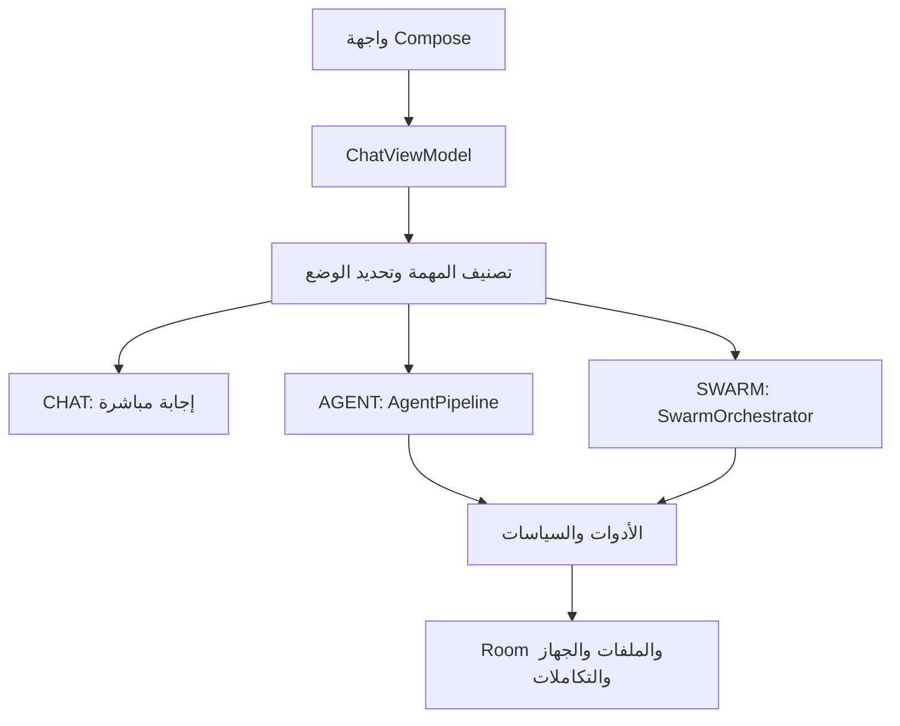

# OmniDev Workspace

**مساحة عمل ومساعد Android قابلان للتوسعة**: محادثة، تنفيذ بأدوات، وتنسيق فريق وكلاء، مع فهرسة محلية للكود، ذاكرة محادثات، طبقة سياسات للصلاحيات، وتكاملات للأجهزة والتطبيقات. هذا المستودع يضم التطبيق Android، اختبارات الوحدة، إعدادات البناء، ووثائق التصميم والتكامل.

> **دليل المشروع:** وصف وظائف التطبيق، بنية الملفات، مسارات الصلاحيات والتكامل، وطريقة البناء والتحقق. آخر تحديث: 4 أكتوبر 2026.

**المطوّر والمحدّث ومسؤول صيانة وتكامل منظومة Omni:** [عبدالرحمن حسين — Abdelrahman Hussein / Obieda](https://github.com/obieda-hussien). تُحفظ حقوق وأسماء مؤلفي أي مكوّن أصلي أو اعتماد خارجي؛ هذا الدور يخص تطوير Omni وتعديلاته وتكاملاته. راجع [بيان النسب والحقوق](ATTRIBUTION.md).

## المحتويات

- [المشروع بالأرقام](#المشروع-بالأرقام)
- [ماذا يفعل التطبيق](#ماذا-يفعل-التطبيق)
- [المساعد العائم على الشاشة](#المساعد-العائم-على-الشاشة)
- [البنية ومسار الطلب](#البنية-ومسار-الطلب)
- [الأوضاع وقرارات الوكيل](#الأوضاع-وقرارات-الوكيل)
- [الاسترجاع المحلي واقتصاد التوكنز](#الاسترجاع-المحلي-واقتصاد-التوكنز)
- [الأدوات والصلاحيات](#الأدوات-والصلاحيات)
- [البيانات والواجهات والتكاملات](#البيانات-والواجهات-والتكاملات)
- [تكامل Omni Launcher](#تكامل-omni-launcher)
- [النسب وحقوق المؤلفين](#النسب-وحقوق-المؤلفين)
- [نسخ البناء والتشغيل](#نسخ-البناء-والتشغيل)
- [الاختبار والتحقق](#الاختبار-والتحقق)
- [خريطة الملفات والوثائق](#خريطة-الملفات-والوثائق)
- [الحدود وخارطة الطريق](#الحدود-وخارطة-الطريق)

حزمة WhatsApp Bridge للتشغيل داخل Termux وخطوات التثبيت والربط موضحة في [دليل الجسر](whatsapp-bridge/README.md).

إعداد بوت Telegram وربط المالك والأوامر وحدود استقبال الوسائط موضحة في [دليل تكامل Telegram](TELEGRAM_INTEGRATION.md).

## المشروع بالأرقام

الأرقام التالية **مستخرجة من الملفات المتتبعة بـ Git في المستودع**، وليست تقديرات تسويقية أو حجم الملفات الناتجة عن البناء. شغّل `python3 scripts/repo_metrics.py` بعد أي تغيير لتحديثها.

| المقياس | العدد | طريقة الحساب |
|---|---:|---|
| الملفات المتتبعة | **545** | كل الملفات المتتبعة الحالية في `git ls-files` |
| ملفات المصدر الإنتاجية | **361** | امتدادات Kotlin/Java/AIDL/C/C++/headers خارج مجلدات الاختبارات |
| سطور المصدر الإنتاجية | **98,330** | سطور فعلية، تشمل الفراغات والتعليقات |
| ملفات مصدر الاختبارات | **72** | نفس الامتدادات داخل `test` أو `androidTest` |
| سطور مصدر الاختبارات | **5,955** | بنفس طريقة العدّ |
| إجمالي ملفات المصدر | **433** | إنتاج + اختبارات |
| إجمالي سطور المصدر | **104,285** | إنتاج + اختبارات |
| ملفات Kotlin | **425** | إنتاج واختبارات معًا |
| سطور Kotlin | **103,512** | إنتاج واختبارات معًا |
| ملفات Markdown | **39** | الوثائق الأساسية وملفات مهارات الوكيل داخل الموارد |
| نسخ التطبيق | **5** | `lite`, `norm`, `pro`, `oem`, `admin` |
| أوضاع التشغيل | **4** | `AUTO`, `CHAT`, `AGENT`, `SWARM` |
| إصدار قاعدة Room | **17** | `OmniDevDatabase.kt` |
| Android SDK | **min 24 / target 36 / compile 36** | `app/build.gradle.kts` |

> **الدقة والتكرار:** يعتمد السكربت على `git ls-files -z` ويقرأ سطور ملفات المصدر في الشجرة المحلية، فلا يدخل `build/`، الملفات غير المتتبعة، الاعتمادات الثنائية، أو كود التوليد. هذه أعداد **سطور في الملفات** وليست “سطور منطقية” بعد حذف التعليقات والفراغات. أرقام Markdown تتغير مع أي تعديل توثيقي؛ لهذا لا ننشر عدد سطورها هنا كرقم ثابت. الأرقام أعلاه تخص ملفات المشروع في لحظة تحديث الوثيقة، وليست إحصاءات الإصدار المنشور.

## ماذا يفعل التطبيق

| القدرة | التنفيذ الأساسي | ملاحظات الاستخدام |
|---|---|---|
| المحادثة | `ChatScreen`, `ChatViewModel`, `CompletionService` | يحدد المستخدم موفّر النموذج وإعداداته |
| تنفيذ المهام | `AgentPipeline`, `AgentRuntime`, `CompositeToolManager` | دورة تخطيط/استدعاء أدوات/ملاحظة ضمن حدود التنفيذ |
| فريق الوكلاء | `SwarmOrchestrator`, `TeamExecutionPolicy`, `TeamBudgetAllocator` | تقسيم المهام عندما توجد أجزاء مستقلة قابلة للعمل |
| الاسترجاع من المستودع | `RepoIndexer`, `RepoContextEngine`, `LocalCodeRetriever` | فهرسة محلية، مقاطع كود قصيرة مع مسار وسطور |
| استرجاع المحادثات | أدوات الجلسات والرسائل مع Room | نصوص أصلية ومعرّفات مرجعية؛ راجع [التفاصيل](CHAT_HISTORY_RECALL.md) |
| أدوات الهاتف | إشعارات، منبه، واجهة وصول، ملفات وأدوات نظام | تختلف الإتاحة حسب النسخة وإذن Android؛ راجع [حدود الإشعارات والمنبه](NOTIFICATION_ALARM_TOOLS.md) |
| الذاكرة والبيانات | Room، مستودعات البيانات، إعدادات محلية | السجل المحلي ومعلومات التشغيل يخضعان لحدود الاحتفاظ المعرّفة في الكود |
| الربط الخارجي | OmniLink، MCP، وخدمات أو تطبيقات مفعّلة | يحتاج بعض المسارات تثبيتًا أو ربط حساب وصلاحيات منفصلة |

### رحلة مهمة نموذجيّة

1. يختار المستخدم وضعًا أو يتركه `AUTO`، فتقرأ الواجهة الرسالة مع إعدادات النموذج والجلسة.
2. يصنف `IntentClassifier` قصد السؤال أو التنفيذ؛ يحافظ المسار على اختيار المستخدم وسياسة التحويل.
3. في `AGENT`، يبني `AgentPipeline` الخطوة التالية ويطلب تعريفات الأدوات المناسبة للسياق؛ في `SWARM` يوزع `SwarmOrchestrator` الأجزاء التي تسمح بخطة عملية.
4. قبل تنفيذ أداة، تُطبَّق حدود النسخة والصلاحية والنطاق وسياسة التأكيد. تُعاد نتيجة محدودة الحجم إلى الوكيل ثم تُضغط عند الحاجة.
5. تحفظ الجلسة والأحداث المسموح بها محليًا، ويمكن ربط النتيجة بصورة المهمة لتغذية القرار لاحقًا؛ النتيجة غير المتحققة تعطى وزنًا أضعف.

طريق التنفيذ يتغير حسب الأداة والنسخة وحالة الجهاز. أسماء الدوال في هذا المسار موجودة في `domain/engine/`, `data/tools/`, و`core/policy/`، وليس المقصود أن كل رسالة تستدعي جميع هذه الطبقات بالترتيب نفسه.

وجود مدير أداة في المصدر **لا يعني** أن كل أداة متاحة في كل نسخة، جهاز، حساب، أو جلسة. `TierToolGate` والسياسات وفحوصات التشغيل يحددون الإتاحة الفعلية؛ العدد الظاهر للأدوات يتغير حسب السياق، لذا لا نضع رقمًا ثابتًا غير قابل للتحقق.

## المساعد العائم على الشاشة

من **AI Settings → Omni on your screen → Set up assistant** اختار Omni كمساعد رقمي افتراضي، واسمح بمحتوى الشاشة ولقطات الشاشة في إعدادات Android. زر الإعداد يستخدم طلب دور المساعد مع متابعة النتيجة وبدائل إعدادات Android لو واجهة الشركة رفضته أو لم تدعمه. ضغطة Home المطوّلة أو إيماءة المساعد تفتح كارت عائم بأيقونة OmniDev فوق التطبيق الحالي.

المساعد يستخدم **وضع AGENT ونموذج الوكيل وأدواته**، مع نفس عارض رسائل الشات والـMarkdown والكونسول. مسار Activity يعرض مراحل التنفيذ واستدعاءات الأدوات ونتائجها بتوقيتاتها الحقيقية. طلب كتابة بيانات صريح يسمح بالإدخال العادي؛ في Norm وPro الطلبات التفسيرية أو الأفعال غير المحددة تعرض زر موافقة قبل التنفيذ؛ OEM وAdmin يتبعان سياسة الموافقة التلقائية مع التدقيق. Lite يستخدم أدوات البحث والذاكرة والمرفقات دون تحكم مباشر في التطبيقات. صلاحيات Android وحدود النسخة وإعدادات الأدوات تظل سارية.

زر **+** يفتح خيارات الإرفاق داخل الكارت؛ منتقي الملفات والصور والفيديوهات يرجع للمحادثة العائمة دون فتح الشات الرئيسي، وإدخال مسار الملف والموافقات يظهران داخل نفس نافذة المساعد لتجنب `BadTokenException`. أيقونة الدرع تفتح **Device access** لتجهيز الصلاحيات ومراجعة حالة الوصول، ثم تعيدك إلى المحادثة الحالية. الصور تستخدم نموذجًا يدعم الرؤية؛ الأنواع غير المدعومة تُرفق بمسارات حقيقية للأدوات دون ادعاء تحليل فيديو كامل. في النسخ التي تدعم التحكم في التطبيقات، زر **−** يصغّر المساعد إلى كورة OmniDev قابلة للسحب تحتاج صلاحية الظهور فوق التطبيقات. التصغير ينتظر تأكيد اتصال الكورة بالشاشة، ويرفض تنفيذ الإيماءات لو فشلت أو انفصلت. التوسيع يتوقف أثناء التنفيذ أو انتظار الموافقة حتى لا تختفي أزرار القرار. الضغط عليها يكمل المحادثة الحالية. كل استدعاء جديد يبدأ محادثة جديدة، بينما المحادثات السابقة ونتائج التنفيذ تظل محفوظة في هيستوري التطبيق.

الصوت يستخدم لغة الجهاز ومحركات خارجية مع بدائل ورسائل أخطاء محددة، وإدخال الصوت من النظام إذا فشل المحرك الداخلي. لقطة الشاشة من `VoiceInteractionSession` تخص الجزء الظاهر عند الاستدعاء، والتطبيقات المحمية قد تمنعها. تفاصيل التنفيذ وحدود التشغيل وفحوصات الجهاز في [دليل المساعد](docs/SCREEN_ASSISTANT.md).

## البنية ومسار الطلب



| الطبقة | مواقع مهمة | المسؤولية |
|---|---|---|
| واجهة التطبيق | `app/src/main/java/com/omnidev/workspace/ui/`, `MainActivity.kt` | شاشات Compose، أحداث التنفيذ والإعدادات |
| مجال التنفيذ | `domain/engine/` | الأوضاع، القرار، سير الوكيل، الميزانيات والضغط |
| الأدوات | `data/tools/`, `core/tools/` | تعريفات الأدوات، التوجيه، التنفيذ والحواجز |
| البيانات | `data/db/`, `data/repo/`, `data/repository/` | Room، فهرس الرموز واسترجاع السياق |
| سياسة النسخ | `core/policy/`, `core/privileged/`, مصادر `app/src/<flavor>/` | تقييد القدرات والموافقات وعزل المسارات المميزة |
| الشبكة والنماذج | `data/network/`, `data/model/`, `registry/` | مزودو الاستكمال، النماذج وتحضير سياقها |

هيكل Gradle الحالي **وحدة `:app` واحدة بخمس نسخ**؛ الرسم المستهدف لوحدات `:core:*` و`:tools:*` في [خطة التفكيك](MODULARIZATION_ROADMAP.md) لم يُنفذ بعد. [المعمارية التفصيلية](PROJECT_ARCHITECTURE.md) تربط المسارات ببعضها.

### دليل التنقل في شجرة المشروع

| المسار من الجذر | ماذا ستجد | سؤال شائع |
|---|---|---|
| `app/src/main/java/com/omnidev/workspace/ui/assistant/` | نافذة المساعد، الإعداد، اختيار منطقة الشاشة ومركز الوصول | كيف أفتح الصلاحيات وأعود للمحادثة؟ |
| `app/src/main/java/com/omnidev/workspace/data/assistant/` | حالة الجلسة، خدمة الصوت والكورة، وسياسة الأفعال | من يحافظ على المحادثة العائمة؟ |
| `app/src/main/java/com/omnidev/workspace/ui/chat/` | الشاشة، ViewModel، أحداث وكشف الوكيل | كيف ظهرت نتيجة الأداة للمستخدم؟ |
| `app/src/main/java/com/omnidev/workspace/domain/engine/` | القرار، Agent/Team، ميزانية التوكنز، الضغط | لماذا اختير الوضع أو توقف الدور؟ |
| `app/src/main/java/com/omnidev/workspace/data/tools/` | مدير الأدوات وعائلاتها وسياسة الإتاحة | لماذا لم تظهر أداة أو فشل تنفيذها؟ |
| `app/src/main/java/com/omnidev/workspace/data/repo/` | فهرسة المشروع واسترجاع مقاطع الكود | من أين جاءت مقتطفات `repo_find_context`؟ |
| `app/src/main/java/com/omnidev/workspace/data/db/` | Room، entities، DAOs، migrations | أين يخزن الحدث أو كيف يهاجر الجدول؟ |
| `app/src/main/java/com/omnidev/workspace/data/ipc/` | خدمات واجهات الربط والامتيازات | من يتصل بخدمة أو تطبيق خارجي؟ |
| `app/src/main/java/com/omnidev/workspace/data/mcp/` | اتصالات وتهيئة MCP | أين تعرّف نقطة MCP؟ |
| `app/src/main/java/com/omnidev/workspace/data/network/` | مزود الاستكمال وتهيئة endpoints | من أين يصل الرد للنموذج؟ |
| `app/src/main/java/com/omnidev/workspace/core/` | عقود الأدوات والسياسات والتجريد المميز | أين حارس حدود النسخة؟ |
| `app/src/test/java/` | اختبارات JVM | أين اختبار الانتقال أو الاسترجاع؟ |
| `app/src/main/aidl/` | عقود Binder | هل التوقيع متوافق مع الطرف الآخر؟ |
| `app/src/main/assets/agent-skills/` | مهارات مرفقة | أي تعليمات تخصصية محملة؟ |
| `.github/workflows/` | مهام CI | ما الذي يتحقق في PR؟ |
| `scripts/` | فحص المستودع والبيانات وإحصاء المصادر | كيف أكرر الرقم في README؟ |

خريطة الملفات التفصيلية وتصنيف الوثائق ونقاط الدخول موجودة في [دليل ملفات المشروع](docs/PROJECT_FILES.md).

طبقات `data/` و`domain/` و`core/` هنا أسماء حزم داخل `:app` وليست وحدات Gradle منفصلة. هذا الفارق مهم عند إضافة اعتماد جديد أو توقع وجود `:core:shared` في البناء.

## الأوضاع وقرارات الوكيل

| الوضع | معناه في الكود | متى يفيد |
|---|---|---|
| `AUTO` | يصنّف الطلب ويختار أحد الأوضاع التنفيذية | عندما يريد المستخدم اختيارًا مبدئيًا آليًا |
| `CHAT` | رد محادثة مباشر دون دورة أدوات الوكيل | أسئلة أو شرح لا يحتاج تنفيذًا |
| `AGENT` | وكيل واحد ينفذ بأدوات وحدود تشغيل | مهمة مترابطة تحتاج قراءة أو تعديل أو تحقق |
| `SWARM` | مخطِّط وعمال لتقسيم العمل | مهام مستقلة تسمح بتوزيع فعلي، مع تكلفة تنسيق إضافية |

القرار ليس مجرد مطابقة كلمات: `IntentClassifier` يستخرج إشارات تنفيذ وتعديل وتحقق وتوازٍ واتساع ومجالات، و`AdaptiveModeRouter` يوازنها مع حالة التنفيذ وتعثره وخطة الفريق. عند وجود مهمة ذرية أو مهمتين متسلسلتين فعليًا قد يقترح الرجوع إلى Agent؛ وعند تعثر Agent مع أجزاء مستقلة قد يقترح Team. مشاكل البنية التحتية أو الإجراءات التي تحتاج المستخدم لا تُعالج تلقائيًا بإضافة وكلاء. **التوصية ليست إذنًا**: `ModeSwitchPermissionStore` يفصل السماح بالتحويل عن درجة الثقة، واختيار المستخدم الصريح له أولوية.

التعلم المحلي في `ModeOutcomeLearner` يحفظ إحصاءات نجاح/فشل/توقف، وقياسات زمن وتكرار وتوكنز *عندما تكون متاحة*. نموذج `ModeDecisionModel` صغير: **12 إشارة رقمية**، وأوزان محدودة لكل وضع، وتحديث تدريجي محدود من النتائج؛ تُخزن الأوزان وإحصاءات مجموعات المهام في `SharedPreferences` محليًا. لا يحتاج تنزيل نموذج ضخم ولا تدريبًا سحابيًا. تأثير خبرة التنفيذ على ثقة اقتراح التحويل محدود بـ **±0.12**؛ ولتغيير ترشيح Agent/Team بناءً على توقع النموذج تُطلب عينات كافية لكليهما وهامش واضح ونجاح وتكلفة مقارنان. السجل الدائري للاختيارات لا يحفظ النص الخام للطلب. هذا **تعلم تدريجي موجّه بالنتائج** وليس ضمانًا لتوقع صحيح؛ فبيانات قليلة أو غير محققة تعطي إشارة ضعيفة.

`AgentDecisionPolicy` و`ContextCompressor` و`TeamHandoffCompressor` يحدّون حجم الملاحظات وتسليم السياق، و`ToolSchemaCompactor` يختار تعريفات أدوات مناسبة للطلب قبل إرسالها للنموذج. [شرح القرار والقياس بالتفصيل](DECISION_ENGINE.md).

## الاسترجاع المحلي واقتصاد التوكنز

`repo_find_context` يبحث في فهرس محلي لملفات المستودع والرموز ثم يعيد مقتطفات قصيرة مع مسار وأرقام سطور. `RepoIndexer` يحدّ الملفات والحجم والرموز، ويتحقق من حدود مسار النطاق عند الفهرسة؛ `LocalCodeRetriever` يرتب المرشحين بمفردات السؤال والاسم والمسار ومرادفات صغيرة. يمكن إعادة فهرسة ملف بدل إعادة المشروع كاملًا. الاسترجاع **معجمي محلي** وليس بحث embeddings شاملًا، ولذلك ينبغي التحقق من المصدر عند غموض الأسماء أو عدم ظهور نتيجة.

الهدف من مقاطع الكود، ترتيب الأدوات، الحدود على المخرجات وضغط تسليم الفريق هو تقليل السياق المرسل بلا خسارة الدليل الضروري. لا يوجد في المستودع حتى الآن قياس إنتاجي موثوق يثبت نسبة توفير توكنز أو تحسن جودة عام؛ المقارنة الصحيحة هي عدد التوكنز والزمن والنجاح المتحقق لكل مهمة قبل وبعد التغيير، وعلى أنواع مهام مختلفة.

استرجاع المحادثات يفصل طلب المستخدم السابق عن ادعاءات المساعد السابقة، ويستخدم `[session:ID message:ID]` مرجعًا للنص الأصلي. حذف قاعدة الجهاز أو عدم وجود الرسالة يعني عدم إمكان استعادتها. راجع [التصميم والقيود](CHAT_HISTORY_RECALL.md).

## الأدوات والصلاحيات

افتح **Device access and permissions** من إعدادات المساعد أو أيقونة الدرع في نافذته. المركز يكتشف صلاحيات النسخة المثبتة، ويعرض حالة الوصول الفعلية، ويتيح تفعيل Accessibility والإشعارات والكيبورد والملفات والميديا وDo Not Disturb وShizuku والتحقق من الروت. طلبات الخلفية منفصلة حسب إصدار أندرويد، ووجود صلاحية في Manifest أو اسم Admin لا يعني أنها ممنوحة. تفاصيل المسارات والحدود والأوامر في [دليل الوصول والصلاحيات](DEVICE_ACCESS.md).


| عائلة الأدوات | مواقع أو أمثلة | حدّ مهم |
|---|---|---|
| الملفات والمستودع | `FileToolManager`, `RepoContextTools`, Git tools | مسارات العمل وحدود القراءة/الكتابة وسياسة النسخة |
| الويب والبحث | أدوات البحث والمتصفح واستخراج الصفحة | تتطلب الشبكة؛ نتائج الويب مدخلات غير موثوقة |
| Android والواجهة | أدوات UI وAccessibility وShizuku عند توافرها | صلاحيات نظام أو خدمة مفعّلة وقدرات النسخة |
| الاتصال والتكامل | OmniLink، MCP، قنوات التواصل | الربط وإذن المستخدم وحالة التطبيق المقابل |
| التذكر والجدولة | Room، البحث في السجل، `planner_tool` | محلي ومحدود؛ فتح محرر أو Intent ليس إثباتًا للحفظ |
| الإشعارات | `read_notifications` | يحتاج Notification Access؛ ذاكرة مؤقتة، وإخفاء الأكواد الشائعة |

طبقة `CompositeToolManager` تجمع التعريفات، ثم يأتي الترشيح حسب النسخة والسياسة والإتاحة. البيانات المستخرجة من أداة أو إشعار أو صفحة **ليست تعليمات مخولة** لتغيير الموافقات. عمليات الجهاز الحساسة تخضع لسياسة النسخة وطبقة التأكيد ذات الصلة. لا تفترض أن وجود علم `ALLOW_*` في بناء معيّن يمنح إذن Android فعليًا.

### Git المحلي وربط GitHub

`git_manager` يستخدم JGit المضمّن في التطبيق، لذلك لا يحتاج تنفيذ Git من عملية Android أو تثبيته داخل Termux. ينفذ `status`, `diff`, `log`, `add`, `commit`, `branch`, `checkout`, و`stash` داخل **Target Context** المحلي. أفعال `remote_status`, `fetch`, `pull`, و`push` تستخدم الحساب المنفصل في **Settings → Integrations & Linked Accounts → GitHub Agent Access**؛ ولا تستخدم اعتماد Copilot/Models. لا يكفي تمكين الإعداد وحده: يجب ربط حساب GitHub أيضًا. يسمح وضع القراءة بـ`fetch` و`pull`، ويتطلب `push` تفعيل الكتابة. لا تمنح الأداة نفسها صلاحيات إضافية للتوكن؛ قيود GitHub الفعلية تظل سارية.

يتحقق المسار البعيد من أن Target Context هو جذر مستودع Git، وأن اسم الـremote مضبوط، وأن عنوانه `https://github.com/owner/repo[.git]` بلا اعتماد مضمن. يرفض SSH والعناوين الخارجية، ويقصر تقديم التوكن على نفس المستودع المصرح به دون تمريره في أوامر طرفية. يجلب `fetch` الفرع الحالي افتراضيًا، ويستخدم `pull` الدمج السريع فقط (`--ff-only`)، ويدفع `push` الفرع الحالي إلى الفرع المناظر له. يمكن تحديد اسم remote أو فرع آمن عند الجلب؛ رفض الدفع إلى فرع مختلف يحمي من تغيير الوجهة بالخطأ. `commit` يهيئ التغييرات ثم يحتاج هوية مؤلف مضبوطة في المستودع أو `authorName` و`authorEmail` مقدمين من المستخدم. `github_manager` مستقل لعمليات REST مثل القضايا وطلبات الدمج؛ سياسة GitHub Agent Access نفسها تحكم الاثنين.

### أدوات سياق المستودع بالتفصيل

| الأداة | النتيجة | متى تستخدمها |
|---|---|---|
| `repo_index_scope` | ملفات ورموز تمت فهرستها أو تخطيها | أول استكشاف أو بعد تغيرات كبيرة |
| `repo_search_symbols` | أسماء الرموز ومواقعها من الفهرس | عندما تعرف اسم class أو function |
| `repo_find_context` | مقتطفات محلية قصيرة مع سطور | سؤال عن سلوك يتطلب دليلًا من الكود |
| `repo_symbols_by_kind` | رموز بحسب النوع | استكشاف بنية الحزم والأنواع |
| `repo_file_symbols` | قائمة رموز ملف | فهم ملف كبير بسرعة |
| `repo_stats` | إحصاءات الفهرس المحلي | تقدير تغطية النطاق المفهرس |

تنفيذ الأدوات الست في `RepoContextTools.kt` يتطلب `scope_path` فعليًا حتى إذا ظهر وسيط النطاق اختياريًا في بعض تعريفات الأدوات؛ هذا فارق يجب ملاحظته عند استخدام API مباشرة. `repo_find_context` يقيّد عدد النتائج إلى **1–12** والافتراضي **6**. عدم العثور على نتيجة قد يعني فهرسًا ناقصًا، وليس غياب الكود. إحصاء `repo_stats` للمشروع المفهرس يختلف عن إحصاء ملفات Git في جدول README.

### سياسة الإشعارات والمنبه

`read_notifications` يعرض حالة وصول Android أو يقرأ/يلخص الإشعارات بعد تصفية التطبيق والكلمة والوقت؛ يحتفظ بحد أقصى **150** إدخالًا في ذاكرة العملية ويمسحها عند قطع اتصال الـlistener. الإرسال والإلغاء يخص إشعارات OmniDev نفسها. `planner_tool` يقرأ المنبه التالي، ويفتح شاشة المنبهات أو يرسل Intent لإنشاء منبه خلال 24 ساعة، ويفتح محرر تقويم للمراجعة. إرسال Intent لا يثبت أن المستخدم حفظ المنبه. [الحدود الدقيقة](NOTIFICATION_ALARM_TOOLS.md).

### سلاسة الواجهة والأداء

الواجهة تستخدم انتقالات تنقل موحّدة تدعم RTL، استجابة خفيفة للأيقونات عند الضغط، وحركة أقصر للأجهزة حتى 4 GiB ووضع توفير البطارية. تحترم تعطيل الأنيميشن من النظام، وتوقف تحديثات الواجهة في الخلفية مع استمرار الوكيل. الشات يحافظ على موضع القراءة أثناء البث، ويوفر زر العودة لآخر رسالة ومراعاة لوحة المفاتيح. تحليل الرسائل والكود يُخزّن حسب النص، وأقسام التحليلات تُرسم عند ظهورها، ويُحدّ من إعادة تجهيز المتصفح وحسابات السجل. تفاصيل سياسة الحركة ومسارات الأداء وطريقة القياس في [دليل الأداء والحركة](UI_PERFORMANCE.md).

## البيانات والواجهات والتكاملات

- **Room v17:** `OmniDevDatabase.kt` يضم الجلسات والرسائل، سجل الأدوات، المعرفة، عناصر ذاكرة الوكيل، فهرس المستودعات، تشخيص البناء، المهام المجدولة والذاكرة المشتركة. الهجرات متدرجة؛ الرجوع إلى “v7” في بعض وثائق التصميم القديمة يشير لمرحلة تاريخية.
- **تكوين محلي:** إعدادات المستخدم والتفضيلات وسجل نتائج اختيار الوضع محفوظة محليًا؛ تفاصيل الموفر والشبكة تتوقف على الإعدادات التي يفعلها المستخدم.
- **واجهات Compose:** الشاشة الرئيسية والمحادثة، الموفرون، إعدادات الذكاء الاصطناعي والمهارات، متصفح، شاشة الذاكرة والتحليلات؛ راجع شجرة `ui/` للحالة الفعلية لكل شاشة.
- **OmniLink/AIDL:** راجع [البروتوكول](LINK_PROTOCOL.md) و[تكامل v3](OMNILINK_V3_INTEGRATION.md). [وثيقة v2](OMNILINK_V2_INTEGRATION.md) تاريخية للمقارنة، وليست مرجع تنفيذ جديد.

### دليل البيانات في Room

| المجال | Entity أو DAO حالي | ما يلزم عند تعديل الشكل |
|---|---|---|
| الجلسات والرسائل | `ChatSessionEntity`, `ChatMessageEntity`, `ChatSessionDao`, `ChatMessageDao` | اختبر البحث والتصفح وحذف الجلسة ومفاتيح المصدر |
| التنفيذ والمعرفة | `ToolExecutionEntry`, `SystemKnowledgeEntry`, `ToolExecutionDao` | راجع احتفاظ البيانات وعرض الأدلة للوكيل |
| فهرس المستودع | `RepoFileIndexEntry`, `RepoSymbolEntry`, `RepoIndexDao` | تحقق من نطاق المشروع وتغيير الملفات |
| ذاكرة الوكيل | `EpisodicMemoryEntry`, `ReflexionLessonEntry` | تجنب ترقية استنتاجات سابقة إلى حقائق مؤكدة |
| الرجوع وتشخيص البناء | `RollbackSnapshotEntry`, `BuildDiagnosticEntry` | افحص حجم التخزين وفشل استعادة النسخة |
| الجدولة والذاكرة المشتركة | `ScheduledTaskEntity`, `SharedMemoryRecordEntity` | راجع أثر الهجرة وتناسق البيانات |

كل entity مذكور مسجل في `OmniDevDatabase.kt`، والإصدار المعلن **17**. وجود هجرة من v6 إلى v7 يشرح النص التاريخي “Agent Brain v7”، لكنه لا يجعل v7 الإصدار الحالي. سلسلة `MIGRATION_*` في الملف وقائمة `addMigrations(...)` هما مرجع تغيير المخطط؛ حدّثهما مع أي تعديل schema، ثم اختبر فتح قاعدة بيانات مستخدم قديم.

### الربط والنماذج

- `CompletionService.kt` نقطة مهمة لاستدعاءات الاستكمال؛ `ProviderEndpoint.kt` و`ProviderModelFetcher.kt` يتعاملان مع إعدادات endpoint ومعلومات النماذج. `ModelRegistry.kt` يعرض سجل النماذج. توفر نموذج بعينه يعود للمزود والإعداد وليس لاسم الوضع.
- `data/ipc/` يتضمن خدمات مثل `OmniCoreService`, `WorkspaceLinkService`, `ExtensionConnectionManager`, `LauncherConnectionManager` ومسار Shell المميز؛ AIDL يحدد العقد البيني. مراجعة هوية التوقيع والصلاحية لازمة عند تغيير الربط.
- `data/mcp/` يحتوي إعدادات واتصالات MCP. نجاح اتصال واحد لا يعني إتاحة جميع الأدوات؛ تخضع الأسماء للتسجيل والتصفية وحدود السياسة والسياق.
- خدمة VPN أو Accessibility قد تتطلب تفعيل Android منفصلًا؛ لا يعطي flag في Gradle هذه الأذونات وحده.

## تكامل Omni Launcher

التكامل المقترح يستخدم OmniLinkSDK **v3.0.0** الموجود؛ لا يضيف إصدار SDK أو ترتيب معاملات AIDL جديدًا. توجد بوابتان منفصلتان:

| المسار | ما يحدث | الشروط |
|---|---|---|
| شريط Omni أو «اسأل Omni» | ينتقل السؤال إلى مسودة الشات في Workspace؛ يراجعه المستخدم ويضغط إرسال | تحديث اللانشر وWorkspace؛ لا يلزم نفس التوقيع |
| تحكم Workspace في اللانشر | اكتشاف قدرات `launcher.*` واستدعاؤها بأداة `omni_link` | نفس شهادة توقيع APK، تفعيل محلي في اللانشر، سقف النسخة، وموافقة على التغييرات |

شريط البحث يدعم اختيار Omni بدل المزوّد الحالي. الاقتراح يظهر في البحث المحلي/بحث التطبيقات عند غياب نتيجة محلية، ويمكن إظهاره دائمًا أو تعطيله. الكتابة وحدها لا ترسل سؤالًا إلى Omni. استقبال السؤال يحافظ على المسودة السابقة والتشغيل الجاري، ويستهلك طلب الانتقال مرة واحدة. اختيار نسخة Workspace متاح عند تثبيت أكثر من نسخة.

| القدرة | الوظيفة | ADMIN / PRO / OEM | NORM | LITE |
|---|---|---|---|---|
| `launcher.health` | حالة الاتصال والموافقة المحلية | نعم | نعم | نعم |
| `launcher.get_settings` | إعدادات البحث المقروءة | نعم | نعم | لا |
| `launcher.list_apps` | التطبيقات الظاهرة في بروفايل المستخدم بصفحات محدودة | نعم | نعم | لا |
| `launcher.set_preference` | تعديل مزوّد البحث أو خيارات اقتراح Omni | بموافقة | لا | لا |
| `launcher.open_app` / `launcher.open_drawer` | فتح تطبيق محدد أو الدرج عندما تكون Home في المقدمة | بموافقة | بموافقة | لا |

اللانشر يكرر حدود النسخة من جهته، ويستبعد التطبيقات المخفية ويرفض تمكين التحكم عن بُعد. البحث عبر ASI وخلاصة Google وSmartspace أسطح مستقلة. اختبارات السياسة المشتركة نجحت: **13 اختبار Kotlin/JUnit مباشرًا**، بدون ادعاء أنها بناء APK أو اختبارات جهاز. [دليل التفعيل والحمولات والأخطاء والتحقق](docs/LAUNCHER_INTEGRATION.md).

## نسخ البناء والتشغيل

| النسخة | الهدف | مصدر الضبط |
|---|---|---|
| `lite` | مسار مستهلك أخف | `app/build.gradle.kts`, `app/src/lite/` |
| `norm` | قدرات استخدام قياسية أوسع | `app/src/norm/`, `app/src/liteNorm/` |
| `pro` | قدرات متقدمة حيث تسمح السياسة والجهاز | `app/src/pro/`, `app/src/proOem/` |
| `oem` | تكامل OEM مع سياسات وتوقيع مناسبين | `app/src/oem/`, `app/src/proOemAdmin/` |
| `admin` | بناء اختبار مطوّر واسع الصلاحيات، غير موجّه للتوزيع العام | `app/src/admin/`, إعدادات التوقيع المحمية |

### أعلام القدرات بحسب البناء

هذه قيم `BuildConfig` من `app/build.gradle.kts`، وليست بيانًا بأن نظام Android منح الأذونات أو أن خدمة خارجية تعمل.

| العلم | Lite | Norm | Pro | OEM | Admin |
|---|:---:|:---:|:---:|:---:|:---:|
| `ALLOW_ROOT` | لا | لا | نعم | لا | نعم |
| `ALLOW_SHIZUKU` | لا | لا | نعم | لا | نعم |
| `ALLOW_ACCESSIBILITY` | لا | نعم | نعم | نعم | نعم |
| `ALLOW_DEEP_SECURITY` | لا | لا | نعم | لا | نعم |
| `AUTO_APPROVE_CONFIRMATIONS` | لا | لا | لا | نعم | نعم |
| `ALLOW_DEVICE_ADMIN_WIPE` | لا | لا | نعم | لا | نعم |
| `ENABLE_LOCAL_SLM` | لا | لا | نعم | نعم | نعم |
| `ALLOW_SYSTEM_INTEGRATION` | لا | لا | لا | نعم | نعم |

راجع `TierPolicy`, `ConfirmationGate`, `TierToolGate` وmanifest النهائي لمسار كل flavor. خصوصًا `AUTO_APPROVE_CONFIRMATIONS` لا يُقرأ باعتباره موافقة عامة من مستخدم Lite/Norm/Pro. ناتج OEM وAdmin موجّه لبيئة وثقة مختلفتين.

المتطلبات: JDK 17، Android SDK المناسب لـ `compileSdk 36`، وGradle Wrapper **8.14.5** مع تحقق SHA-256 من التوزيع، واتصال قادر على تنزيل الاعتمادات. بعض بناءات التكامل تحتاج اعتماد OmniLink بحسب إعداد `settings.gradle.kts` وخطوات CI. لا تضع مفاتيح التوقيع أو بيانات الاعتماد في المستودع. أوامر سريعة من جذر المشروع:

```bash
./gradlew :app:assembleLiteDebug
./gradlew :app:assembleNormDebug
./gradlew :app:testNormDebugUnitTest
./gradlew :app:lintNormDebug
python3 scripts/repo_metrics.py
```

اسم الحزمة والخصائص والأذونات تختلف حسب flavor وmanifest؛ افحص **البناء المقصود** قبل توزيعه. إعدادات التوقيع المشتركة ونسخة Admin في `app/build.gradle.kts` وCI. لا تُعامل بناء Admin كتوزيع للمستخدمين.

## الاختبار والتحقق

اختبارات الوحدة موجودة في `app/src/test/` للاختيار التكيفي، إشارات النية، النموذج الصغير، ضغط السياق، الفريق، حراسة الأدوات، استرجاع الكود والسجل، وسياسات النسخ. `android-ci.yml` يعرّف مهام جودة وlint واختبارات للنسخ الخمس وتجميع إصدار؛ نتائج البناء والاختبارات تُراجع في GitHub Actions؛ تعريف المهمة في YAML وحده لا يثبت نجاح تنفيذها. للاختبار المركز:

```bash
./gradlew :app:testNormDebugUnitTest --tests 'com.omnidev.workspace.domain.engine.*'
./gradlew :app:compileNormDebugKotlin :app:compileAdminDebugKotlin
```

أي ادعاء بتحسن الدقة أو توفير التوكنز يحتاج تجربة ممثلة مع نتائج قابلة للمقارنة، خصوصًا على المهام العربية، الملفات الكبيرة، الطلبات الغامضة، وحالات فشل الأدوات. تفاصيل توقعات السلوك في [وثيقة المحرك](DECISION_ENGINE.md).

### دليل تغيير آمن وسريع

| إذا غيّرت | افحص بالتبعية | تحقق مناسب |
|---|---|---|
| إشارات أو عتبات AUTO | `IntentClassifier`, `AdaptiveModeRouter`, `ModeOutcomeLearner`, `ChatViewModel` | حالات عربية/إنجليزية، اختيار المستخدم، فشل البنية، المهمة الذرية |
| ترتيب أدوات النموذج | `ToolSchemaCompactor`, `CompositeToolManager`, `TierToolGate` | جودة الأدوات المعروضة وحدود schema ورفض النسخة |
| استرجاع المشروع | `RepoIndexer`, `RepoContextEngine`, `LocalCodeRetriever` | ربط symlink ونطاق المشروع، تحديث ملف، مقتطفات وأرقام سطور |
| محادثة قديمة | DAOs والبحث في السجل و`ChatViewModel` | مرجع الجلسة/الرسالة، حذفها، النص الطويل وعزل المصدر |
| Service أو صلاحية | `AndroidManifest.xml` لكل flavor والسياسات | الـmerged manifest، رفض الإذن، تجربة جهاز |
| Entity أو schema | `OmniDevDatabase.kt`, DAO, migration | فتح قاعدة قديمة وحفظ بياناتها |
| بروتوكول OmniLink | ملفات AIDL وخدمات `data/ipc/` | ABI، الهوية، انقطاع Binder، خطأ الطرف المقابل |

نتائج اختبار وحدة معزولة لا تغطي سلوك جهاز فعلي أو manifest merger أو مشكلة إصدار سابق. لهذا يقسم CI إلى جودة وlint واختبارات وتجميع. نجاح build لا يثبت جودة قرارات الوكيل؛ هذه تقاس على مهام بنواتج متحققة.

## خريطة الملفات والوثائق

| ابدأ هنا | لو تريد |
|---|---|
| [docs/PROJECT_FILES.md](docs/PROJECT_FILES.md) | تصنيف ملفات المشروع ونقاط الدخول ومسؤولية كل مجموعة |
| [DEVICE_ACCESS.md](DEVICE_ACCESS.md) | تصريحات الصلاحيات، تهيئة الوصول، مسارات التنفيذ والتحقق |
| [docs/SCREEN_ASSISTANT.md](docs/SCREEN_ASSISTANT.md) | المساعد العائم والصوت والإرفاق والعودة للجلسة |
| [PROJECT_ARCHITECTURE.md](PROJECT_ARCHITECTURE.md) | حدود الطبقات وتدفق الطلب وسياسات البناء |
| [MENTAL_MAP.md](MENTAL_MAP.md) | خريطة سريعة لنقاط الدخول وسيناريوهات القرار |
| [DECISION_ENGINE.md](DECISION_ENGINE.md) | تفاصيل نموذج القرار والتعلم والحدود ومقاييس الجودة |
| [CHAT_HISTORY_RECALL.md](CHAT_HISTORY_RECALL.md) | استرجاع محادثة مصدرها Room وحدود الإثبات |
| [NOTIFICATION_ALARM_TOOLS.md](NOTIFICATION_ALARM_TOOLS.md) | قدرات وإذونات الإشعارات والمنبه |
| [MODULARIZATION_ROADMAP.md](MODULARIZATION_ROADMAP.md) | خطة مستقبلية لفصل `:app` إلى وحدات Gradle |
| [OMNIDEV_VISION_AND_ROADMAP.md](OMNIDEV_VISION_AND_ROADMAP.md) | أفكار مستقبلية ومقترحات المنتج، ليست كلها منفذة |
| [OMNILINK_V3_INTEGRATION.md](OMNILINK_V3_INTEGRATION.md), [LINK_PROTOCOL.md](LINK_PROTOCOL.md) | بروتوكول وتكامل OmniLink |
| [docs/LAUNCHER_INTEGRATION.md](docs/LAUNCHER_INTEGRATION.md) | مسودة السؤال وصلاحيات التحكم في اللانشر |
| [ATTRIBUTION.md](ATTRIBUTION.md) | دور المطوّر وحفظ حقوق المكوّنات الأصلية |
| [00_INTEGRATION_ORDER.md](00_INTEGRATION_ORDER.md), `01_...` إلى `08_..._PROMPT.md` | مواد تخطيط وتكامل تاريخية لمشروعات المنظومة؛ قارنها بالكود قبل التنفيذ |
| [mcp_plan.md](mcp_plan.md), [.circleci/README.md](.circleci/README.md) | خطط/إعدادات تكامل إضافية بحسب سياقها |

## الحدود وخارطة الطريق

- **الدقة:** تصنيف النية واسترجاع الكود تقريبيان؛ نجاحهما يعتمد على النص، الفهرس، البيانات والتغطية. لا تتعامل مع درجة الثقة كتأكيد من النموذج الأساسي.
- **التعلم:** بيانات البداية قليلة وقد تكون متحيزة. النموذج المحلي لا يملك بيانات تدريب خارجية افتراضيًا، ولا يملك سلطة تجاوز اختيار المستخدم أو أذونات التحويل.
- **الكلفة:** ضغط السياق وانتقاء الأدوات يقللان الحمل المتوقع، لكن لا توجد نسبة توفير مثبتة منشورة. سجّل تكلفة النتائج المتحققة قبل إطلاق ادعاءات كمية.
- **الفصل المعماري:** التطبيق ما زال وحدة Gradle واحدة؛ [خطة التفكيك](MODULARIZATION_ROADMAP.md) تسرد الاعتماديات وخطوات النقل والتحقق.
- **المواصفات السابقة:** وثائق الـPROMPT والرؤية تمثل نوايا وخططًا، ولا تثبت أن القدرة دخلت إصدارًا أو أن تكاملًا خارجيًا متاح حاليًا.

عند تعديل عدد الملفات أو المسارات أو أوضاع التشغيل، أعد تشغيل `scripts/repo_metrics.py` وحدّث هذا الجدول والوثائق المعمارية معه؛ الأرقام توثّق الملفات الحالية ويعاد حسابها مع تغيّر المشروع.


## النسب وحقوق المؤلفين

تطوير OmniDev Workspace وتحديثاته وتعديلاته وتكاملاته من مسؤولية **عبدالرحمن حسين / Obieda**. تظل حقوق مؤلفي المكوّنات الأصلية والمكتبات والتطبيقات المتصلة محفوظة بحسب تراخيصها وترويساتها. Omni Launcher مبني على Lawnchair وAOSP؛ الربط به لا ينقل ملكية أساسه إلى Workspace. يظل ترخيص OmniLinkSDK مستقلًا. [بيان النسب والحقوق](ATTRIBUTION.md) يوضح حدود هذا النسب دون إضافة ترخيص جديد للمستودع.
