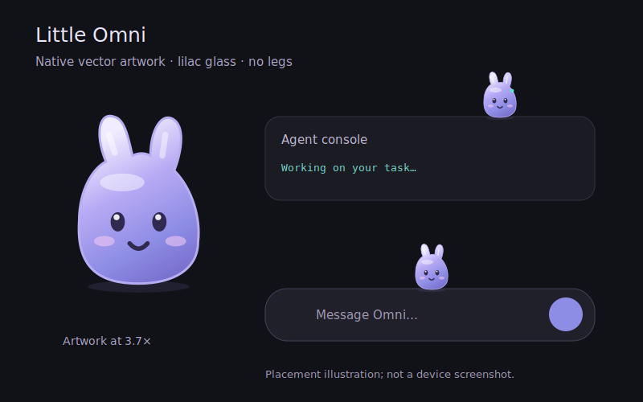

# Little Omni

Little Omni is a native, lilac companion in the main chat and floating assistant. It has a soft body, two small ears and no legs. The artwork is drawn with Compose Canvas paths and gradients; the app does not load the documentation images at runtime.

The illustration shows the drawing and intended placement, not a device screenshot.

- Hops along the actual composer, visible agent consoles and the top edges of your message bubbles. Stable message/console keys let it ride a platform during scrolling. It jumps to another safe surface before its perch reaches a viewport edge, and escapes if a LazyColumn item disappears.
- Tap for a tumble and recovery; drag gently to choose a nearby perch, or fling it for a short gravity-driven flight with wall bounces. Placement, drag deltas and throw velocity use physical screen coordinates in both RTL and LTR layouts. Pickup freezes autonomous movement and tracks the finger in root coordinates. Landings compress and rebound; the ears sway with movement. It stays above the editor and within the transcript viewport.
- Eyes follow touches and the actual shaped text cursor while you type or move the selection. Arabic, English and mixed text use Compose paragraph geometry rather than a guessed writing direction. The editor owns its vertical text viewport so cursor positions include wrapping and draft scrolling. Eye direction follows the viewing angle instead of saturating at both extremes. After a typing pause it glances toward the visible keyboard area (not individual key touches, which belong to the IME), or the caret if no IME is visible; during work it watches the console.
- Expressions use actual run events for thinking, tools, confirmation, listening and errors. A short celebration follows a successful run; opening an old completed conversation or pressing Stop does not trigger one. Idle breathing, a small curious tilt and occasional ear twitch add subtle motion. It sleeps after idle time and wakes when you interact. Reduced motion disables these transforms.
- Long press opens a small inline controls card with a return-to-composer action and **Hide for 5 minutes**. This works in the floating assistant's existing window too. Outside touches dismiss it without consuming the underlying gesture; while open it pauses autonomous motion.
- Hiding starts a sad, slow sequence of small hops toward the nearest physical edge, clipped within the host. Tapping or grabbing the remaining visible part before it exits cancels departure: it looks happy, follows a held finger, then returns with three quick bounces. Other chat touches do not cancel departure. Reduced motion gives a stationary three-second sad grace period and an immediate happy rescue. Once hidden, its reserved gaps close smoothly; it returns after five minutes, on a new chat/host, or by toggling visibility back on. The preference stays enabled.
- Idle curiosity has varied intervals and avoids immediate repeats: looking around, sniffing, yawning and stretching. Touch/typing, work, decision/listening states and reduced motion interrupt these moments. Its timer spans automatic hops so roaming cannot starve curiosity. These behaviors are local and use cached vector artwork.
- Settings → Virtual companion controls visibility and automatic hopping. Preferences apply to both chat hosts.
- Reserves 60 dp above the composer/console and adds 36 dp above user bubbles, sharing the existing 24 dp transcript gap. It pauses when the host lifecycle stops, follows system reduced motion, and uses a 30 fps ticker on compact devices. Very short windows and assistant confirmation/tool panels hide it. Settings also offer a static expression preview.
- Only the 60 dp sprite and the open inline controls consume pointer input. The host observes touches for gaze and outside-dismissal without consuming scroll, selection or control gestures. Semantic actions support playing, opening controls, temporary hiding and returning to the composer. There are no extra windows, model calls or Activity result launchers.

`CompanionMotionTest` has 34 cases covering moving/disappearing perches, viewport escape, small bubbles, flight continuity, throw/bounce/landing, angular gaze, idle motion, run reactions, reduced motion, recovery, resize, sleeping, slow exit on either edge, tap/drag/late rescue, fast return, and varied/interruptible curiosity. The eleven `ChatCompanionTest` cases cover real editor geometry, send/stop availability, preferences, hidden/tiny hosts, real message perches and scrolling, conversation events, RTL/LTR dragging, bilingual caret/selection, actual long-press controls, outside-dismissal/typing, temporary hiding and RTL grab rescue. The API 30 UI regression workflow runs them with the existing chat, keyboard and assistant tests.
